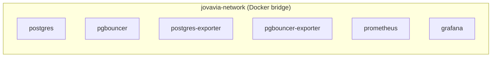

# ADR-0004: Shared Docker Network

| | |
|---|---|
| **Status** | Accepted |
| **Sprint** | Sprint 0 — Infrastructure Foundation |
| **Related** | [ADR-0002: Docker Compose Modular Architecture](ADR-0002-docker-compose-modular-architecture.md), [Networking](../architecture/networking.md), [Docker Compose Networking (Reference)](../concepts/docker-compose-networking.md) |

## Context

Six services split across six Compose files (ADR-0002) still need to resolve and reach each other by name — PgBouncer needs to reach PostgreSQL, both exporters need to reach their respective targets, Prometheus needs to reach both exporters, and Grafana needs to reach Prometheus. Docker Compose's default behavior, left unconfigured, creates one bridge network scoped to the *Compose project* invoking it — which is fine when every service comes from the same invocation, but becomes a real risk the moment a single component's file is run in isolation (e.g., while iterating on one service), which would otherwise create a second, disconnected, project-scoped bridge network sharing nothing with the one the rest of the stack actually uses.

## Decision

One named Docker network, `jovavia-network`, declared exactly once — in `docker/postgres/docker-compose.yml`, the only one of the six component files that does not mark it `external: true`. Every other component file (`pgbouncer`, `postgres-exporter`, `pgbouncer-exporter`, `prometheus`, `grafana`) declares the same network as `external: true`, meaning "this network must already exist — fail if it's missing, don't create it." Every service attaches to this one network; there is no per-tier or per-service network segmentation today.

## Consequences

Service discovery is entirely DNS-based and entirely implicit — no service hardcodes an IP address anywhere; Docker's embedded DNS resolves each service's Compose service name to its current container IP on `jovavia-network`, which is why `POSTGRES_HOST=postgres` works identically across restarts even as the container's actual IP changes. Because `include:` merges all six files into one logical project before creating anything, `docker compose up -d` from the repository root always works regardless of file order — the network is created once, and every other service attaches to that same network object.

The ownership pattern creates a real, deliberate ordering dependency: PostgreSQL's compose file must be part of any startup that includes downstream services, or those services fail immediately with `network jovavia-network declared as external, but could not be found` rather than silently creating a disconnected network — this is the specific failure mode `external: true` is chosen to surface loudly instead of masking. Every service's port is also published to the host (not just exposed internally) for developer ergonomics — direct `psql`, direct access to the Prometheus and Grafana UIs — which is a Sprint 0-appropriate tradeoff, not one that should carry unchanged into a shared environment (see Future Evolution).

## Alternatives

| Option | Why not chosen |
|---|---|
| Let Compose create its own default per-project network, no explicit declaration | Works only as long as every startup includes every file together — running any one component file in isolation (a common local-iteration pattern) silently creates a second, disconnected network instead of failing loudly, which is a much harder failure mode to diagnose than an explicit error. |
| One network per tier (data, observability) from the start | A real, deliberate future improvement (see Future Evolution) but not justified at Sprint 0's scale — six services with no meaningfully different trust boundaries yet; segmenting now would add operational complexity with no corresponding benefit until the exporter/PgBouncer/Postgres trust boundary actually matters. |
| Docker host networking (no bridge network at all) | Removes network isolation between containers and the host entirely, breaks the port-mapping model this stack's developer ergonomics rely on, and doesn't generalize past a single host. |

## Future Evolution

Introduce network segmentation — a data-tier network for Postgres/PgBouncer/exporters and a separate observability-tier network for Prometheus/Grafana, with only the exporters bridging both — once the current flat, single-network model's blast radius (a compromised exporter container has direct network reachability to PostgreSQL and PgBouncer) becomes a real rather than theoretical concern. Stop publishing PostgreSQL and PgBouncer ports directly to the host outside local development, gating them behind a bastion or VPN-only access pattern for any shared environment.
