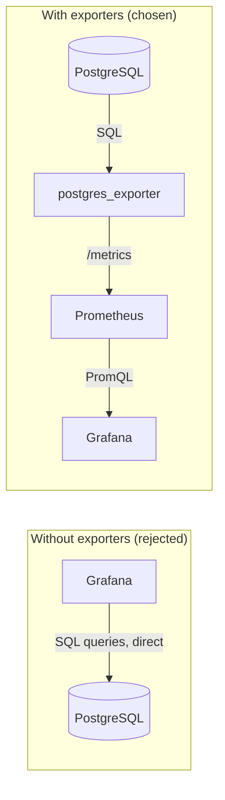

# ADR-0031: Metrics Exporters (postgres_exporter, pgbouncer_exporter)

| | |
|---|---|
| **Status** | Accepted |
| **Sprint** | Sprint 0 — Infrastructure Foundation |
| **Related** | [ADR-0027: PgBouncer Connection Pooling Architecture](ADR-0027-pgbouncer-architecture.md), [Observability](../architecture/observability.md), [Prometheus & PromQL (Reference)](../concepts/prometheus-and-promql.md) |

## Purpose

Decide how PostgreSQL and PgBouncer's internal state becomes visible to Prometheus. This ADR records the choice of **community-maintained sidecar exporters** over the alternatives (native Prometheus support, custom-built exporters, or polling from Grafana directly).

## Architecture

**Context.** Neither PostgreSQL nor PgBouncer natively speaks Prometheus's exposition format — both expose their internal state through SQL-queryable interfaces (`pg_stat_*` catalog views for Postgres; `SHOW POOLS`/`SHOW STATS`/etc. admin commands for PgBouncer, issued over the standard Postgres wire protocol against a virtual `pgbouncer` database). Something has to bridge SQL-shaped state into Prometheus's pull-based `/metrics` HTTP endpoint format.

**Decision.** Run `prometheuscommunity/postgres-exporter` and `prometheuscommunity/pgbouncer-exporter` as dedicated sidecar containers — one process per monitored component, each translating that component's native interface into a `/metrics` endpoint Prometheus scrapes directly.



**Alternatives considered:**

| Option | Why not chosen |
|---|---|
| Grafana's native PostgreSQL SQL datasource, querying `pg_stat_*` directly | No time-series storage or alerting — Grafana would be running the same expensive introspection queries on every dashboard refresh, adding load to Postgres in direct proportion to dashboard viewers, with no historical retention or PromQL alerting capability. |
| Build a custom exporter from scratch | Community exporters already cover the standard `pg_stat_database`, `pg_stat_activity`, `pg_settings`, `pg_locks` surface (Postgres) and `SHOW POOLS`/`SHOW STATS` surface (PgBouncer) comprehensively; building custom means maintaining query correctness against every future Postgres/PgBouncer version ourselves for no benefit over an actively maintained upstream project. |
| PostgreSQL's built-in statistics via `pg_stat_statements` alone, no exporter | `pg_stat_statements` (already enabled via `shared_preload_libraries` in `postgresql.conf`) is query-level detail, not instance-level health — complementary to, not a replacement for, exporter-level metrics like connection counts and lock contention. |
| Sidecar-per-service exporter pattern vs. one shared exporter for multiple Postgres instances | Not yet relevant at Sprint 0's single-instance scale; revisit if/when the data layer is sharded (see [PostgreSQL Internals (Reference)](../concepts/postgresql-internals.md) Future Improvements). |

## Configuration

```yaml
# docker/postgres-exporter/docker-compose.yml
services:
  postgres-exporter:
    image: prometheuscommunity/postgres-exporter:v0.17.1
    environment:
      DATA_SOURCE_URI: "${POSTGRES_HOST}:${POSTGRES_PORT}/jovavia_identity?sslmode=disable"
      DATA_SOURCE_USER: "${POSTGRES_USER}"
      DATA_SOURCE_PASS: "${POSTGRES_PASSWORD}"
    ports: ["${POSTGRES_EXPORTER_PORT}:9187"]
```

```yaml
# docker/pgbouncer-exporter/docker-compose.yml
services:
  pgbouncer-exporter:
    image: prometheuscommunity/pgbouncer-exporter:v0.11.0
    depends_on:
      pgbouncer: { condition: service_started }
    environment:
      PGBOUNCER_EXPORTER_CONNECTION_STRING: "postgres://${POSTGRES_USER}:${POSTGRES_PASSWORD}@${PGBOUNCER_HOST}:${PGBOUNCER_PORT}/pgbouncer?sslmode=disable"
    ports: ["${PGBOUNCER_EXPORTER_PORT}:9127"]
    healthcheck:
      test: ["CMD", "wget", "-qO-", "http://localhost:9127/metrics"]
```

Note the asymmetry: `postgres-exporter` has no `depends_on` at all (relies on retry/backoff behavior against a not-yet-ready Postgres), while `pgbouncer-exporter` depends on `pgbouncer`'s `service_started` condition specifically — neither waits for their target's full readiness in the strictest sense, but `pgbouncer-exporter` is the only one of the two with its own `healthcheck`, giving Compose (and future orchestration) a real signal for *its* readiness even if its upstream dependency's readiness isn't strictly gated.

## Operational Notes

`postgres_exporter` connects using `DATA_SOURCE_URI` pointed at `jovavia_identity` — this is not a limitation despite initial appearances. `pg_stat_database`, `pg_stat_activity`, `pg_settings`, and `pg_locks` are cluster-wide system catalog views, visible to any authenticated connection regardless of which specific database it connected to. One connection to one database is sufficient to observe metrics for all five Jovavia databases.

`pgbouncer_exporter`'s connection string authenticates against PgBouncer's special `pgbouncer` administrative database (not a real Postgres database — a virtual interface PgBouncer itself provides to its own admin console), which is why its target host/port point at PgBouncer (`PGBOUNCER_HOST:PGBOUNCER_PORT`), not PostgreSQL directly.

## Troubleshooting

**`postgres_exporter`'s `/metrics` endpoint returns very few metrics, or errors on scrape.** Usually a permissions problem — the connecting role needs at minimum `pg_monitor` (or equivalent granular grants) to read the full `pg_stat_*` surface; a role with only default privileges will see a truncated metric set silently, not an error, which makes this easy to miss. Verify with `docker compose exec postgres-exporter wget -qO- http://localhost:9187/metrics | grep pg_up`.

**`pgbouncer_exporter` metrics are missing pool-level detail for a specific database.** Confirm that database has actually had at least one connection routed through PgBouncer since the last restart — `SHOW POOLS` (and therefore the exporter) only reports pools that have been instantiated, not every database PgBouncer could theoretically serve via the wildcard `[databases]` entry (see [ADR-0027: PgBouncer Connection Pooling Architecture](ADR-0027-pgbouncer-architecture.md)).

**Both exporters are up but Prometheus shows the target as `DOWN`.** Check `prometheus.yml`'s `static_configs` targets match the actual Compose service names exactly (`postgres-exporter:9187`, `pgbouncer-exporter:9127`) — a typo here fails silently from the exporter's perspective; only Prometheus's `/targets` page surfaces it.

## Production Considerations

- Both exporters authenticate with the same credentials the application layer uses (`POSTGRES_USER`/`POSTGRES_PASSWORD`) rather than a dedicated, minimally-privileged monitoring role. A compromised exporter container today has the same database access as the application — this should be a dedicated read-only/`pg_monitor`-scoped role before this leaves local development.
- Neither exporter's connection is TLS-encrypted (`sslmode=disable` explicit in both connection strings) — acceptable for same-host Docker networking, not acceptable across a real network boundary.
- Exporter version pinning (`v0.17.1`, `v0.11.0`) is good practice already in place — bump deliberately, not automatically, and read release notes for metric name/label changes, which are a common source of "the dashboard broke after an upgrade" incidents with these exporters specifically.

## Future Improvements

- Create a dedicated `jovavia_monitor` role with `pg_monitor` grants for `postgres_exporter`, distinct from the application's `jovavia` role — least-privilege for the observability pipeline.
- Add TLS between exporters and their targets once this stack runs across any real network boundary.
- Consider `postgres_exporter`'s custom-queries YAML feature to add Jovavia-specific metrics (e.g., per-database row counts, custom business-relevant table stats) beyond the built-in catalog-view coverage, once there's a concrete monitoring need for it.
- Re-evaluate exporter placement (sidecar-per-instance vs. shared) if the data layer moves to per-service Postgres instances or read replicas.
