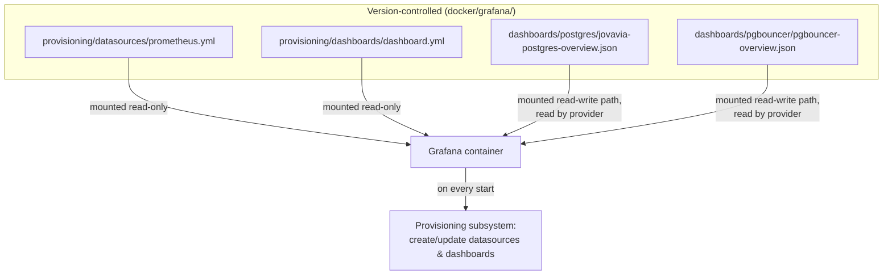

# ADR-0032: Grafana Provisioning (File-Based, Not UI/API)

| | |
|---|---|
| **Status** | Accepted |
| **Sprint** | Sprint 0 — Infrastructure Foundation |
| **Related** | [Observability](../architecture/observability.md), [Grafana Dashboards-as-Code (Reference)](../concepts/grafana-dashboards-as-code.md), [Grafana Runbook](../runbooks/grafana-runbook.md) |

## Purpose

Decide how Grafana's datasources and dashboards get into a running Grafana instance: manually through the UI, via API calls in a setup script, or declaratively from files Grafana reads on startup. This ADR records the choice of **file-based provisioning** and documents a real, non-obvious interaction between two of this stack's own provisioning settings that changes where dashboards actually end up.

## Architecture

**Context.** A freshly-started Grafana container has no datasources and no dashboards — every prior approach to solving this (click through the UI after each `docker compose up`, or script it via Grafana's HTTP API) is either manual toil repeated on every environment rebuild, or an imperative script that can drift from what's actually version-controlled.

**Decision.** Mount provisioning YAML and dashboard JSON as read-only volumes; Grafana's own provisioning subsystem reads them on every container start and reconciles state automatically — datasources and dashboards are defined in Git, not clicked into existence.



**Alternatives considered:**

| Option | Why not chosen |
|---|---|
| Manual UI configuration | Not reproducible, not version-controlled, not survivable across `docker compose down -v`. |
| Grafana HTTP API + setup script | Imperative, requires the script to run at the right time relative to Grafana's readiness, and creates a second source of truth (the script) separate from the dashboard JSON itself. |
| Grafana Terraform provider | Real option for larger, multi-environment Grafana fleets; more operational machinery than Sprint 0's single-instance local stack justifies today. Worth revisiting — see Future Improvements. |

## Configuration

```yaml
# docker/grafana/provisioning/datasources/prometheus.yml
apiVersion: 1
datasources:
  - name: Prometheus
    uid: prometheus
    type: prometheus
    access: proxy
    url: http://prometheus:9090
    isDefault: true
    editable: false
```

```yaml
# docker/grafana/provisioning/dashboards/dashboard.yml
apiVersion: 1
providers:
  - name: "Jovavia Infrastructure"
    type: file
    orgId: 1
    disableDeletion: false
    editable: true
    options:
      path: /var/lib/grafana/dashboards
      foldersFromFilesStructure: true
```

```yaml
# docker/grafana/docker-compose.yml (volume mounts)
volumes:
  - ./provisioning/datasources:/etc/grafana/provisioning/datasources:ro
  - ./provisioning/dashboards:/etc/grafana/provisioning/dashboards:ro
  - ./dashboards:/var/lib/grafana/dashboards
```

**Folder placement, stated precisely:** `dashboard.yml` sets `options.foldersFromFilesStructure: true` and no static `folder:` field. With `foldersFromFilesStructure` enabled, Grafana derives each dashboard's folder from its path *relative to* `options.path` — there is deliberately no provider-level `folder` value to conflict with that. `docker/grafana/dashboards/postgres/jovavia-postgres-overview.json` and `docker/grafana/dashboards/pgbouncer/pgbouncer-overview.json` are mounted at `/var/lib/grafana/dashboards/postgres/...` and `/var/lib/grafana/dashboards/pgbouncer/...` respectively, so Grafana creates folders named **"postgres"** and **"pgbouncer"**. The resulting (and intended) folder tree, filled in as components ship:

```
Dashboards/
├── postgres/    (shipped)
├── pgbouncer/   (shipped)
├── redis/       (planned, Sprint 1)
├── kafka/       (planned, Sprint 2)
└── platform/    (planned)
```

An earlier revision of `dashboard.yml` also set a static `folder: "Jovavia"` field, which `foldersFromFilesStructure: true` silently overrode — that field has been removed as dead configuration rather than left in place to confuse the next reader.

## Operational Notes

Provisioning reconciliation runs **on every Grafana container start**, not once — this is the mechanism that makes file changes show up after a `docker compose restart grafana` without any manual re-import step. It also means a dashboard manually edited in the Grafana UI (`editable: true` on the provider) will have those UI edits **overwritten** on next restart by whatever's in the mounted JSON file, unless the change is also committed back to the file — a common point of confusion the first time someone tweaks a panel in the UI and loses the change on redeploy.

## Troubleshooting

**Dashboards don't appear at all.** Check `docker compose logs grafana` for provisioning errors first — malformed JSON in a dashboard file fails that one dashboard's provisioning, typically without failing the whole container. Confirm the mounted path matches what `dashboard.yml`'s `options.path` expects (`/var/lib/grafana/dashboards`).

**A new component's dashboard lands in an unexpected folder.** This is the `foldersFromFilesStructure` behavior documented above, not a bug — the folder name always matches the dashboard file's subdirectory under `docker/grafana/dashboards/`. Place a new dashboard JSON file under the subdirectory matching its intended folder name (e.g. `dashboards/redis/` for a future Redis dashboard) rather than expecting a folder name to be configurable from `dashboard.yml`.

**A UI edit to a dashboard disappeared after a restart.** Expected — provisioned dashboards are reconciled from file on every start. Edit the JSON file and commit it; don't rely on UI edits surviving.

## Production Considerations

- File-based provisioning means dashboard changes require a container restart (or Grafana's provisioning reload, if configured) to take effect — acceptable for infrastructure-as-code discipline, worth knowing before assuming a JSON edit is "live" the moment it's saved.
- `disableDeletion: false` and `editable: true` together mean anyone with Grafana UI access can delete or modify provisioned dashboards through the UI — those changes are only ever reverted on the *next* container restart, so there's a window where the UI and the source-of-truth JSON disagree. Consider `editable: false` for any dashboard that should be strictly source-controlled, at the cost of losing in-UI exploration/tweaking.
- `GRAFANA_ADMIN_PASSWORD=admin` (the `.env.example` default) combined with UI-editable, deletable dashboards is a real risk the moment Grafana is reachable by anyone beyond the person who started the stack — see [Environment Variables](../setup/environment-variables.md) Production Considerations.

## Future Improvements

- Evaluate the Grafana Terraform provider or `grafonnet`/Jsonnet-based dashboard generation once dashboard count and team size justify more tooling than hand-authored JSON files.
- Set `editable: false` on provisioned dashboards once they're stable, forcing all changes through version control and eliminating the UI/file drift window described above.
- Add a CI check that validates every dashboard JSON file under `docker/grafana/dashboards/` is well-formed and references a datasource UID that actually exists in `provisioning/datasources/`, catching the "malformed JSON silently fails to provision" failure mode before it reaches a running environment.
