# ADR-0033: Prometheus Alerting Rules

| | |
|---|---|
| **Status** | Accepted, partially implemented |
| **Sprint** | Sprint 0 — Infrastructure Foundation |
| **Related** | [Observability](../architecture/observability.md), [Prometheus & PromQL (Reference)](../concepts/prometheus-and-promql.md), [Prometheus Runbook](../runbooks/prometheus-runbook.md) |

## Purpose

Decide what conditions constitute "something is wrong" for the data layer, encode them as Prometheus alert rules, and record explicitly what this ADR does **not** yet cover: routing a firing alert to a human. Marking that gap here, in the decision record itself, is deliberate — it should not be possible to read this ADR and conclude alerting is operationally complete.

## Architecture

**Context.** Metrics without alerting tell you what happened after you go looking. The four conditions chosen for Sprint 0 are the minimum viable signal set for the two components that exist: is the process up, and is it approaching a known resource ceiling.

**Decision.** Four rules, two severities, two rule groups:

```mermaid
flowchart TD
    subgraph "postgres.rules"
        R1["PostgreSQLDown\npg_up == 0\nfor: 1m\ncritical"]
        R2["PostgreSQLTooManyConnections\npg_stat_activity_count > 80\nfor: 2m\nwarning"]
    end
    subgraph "pgbouncer.rules"
        R3["PgBouncerDown\npgbouncer_up == 0\nfor: 1m\ncritical"]
        R4["PgBouncerPoolSaturation\npgbouncer_pools_client_waiting_connections > 10\nfor: 2m\nwarning"]
    end
    R1 & R2 & R3 & R4 --> Eval["Prometheus rule evaluation\nevery 15s (evaluation_interval)"]
    Eval --> Fire["Alert state: firing"]
    Fire --> Dead["/alerts UI page\n— and nothing else"]
    style Dead fill:#4a1f1f,stroke:#a33
```



**Why `for: 1m` on the `*Down` rules and `for: 2m` on the threshold rules:** `for:` requires a condition to hold continuously across that duration before the alert transitions from `pending` to `firing` — this exists specifically to suppress single-scrape blips (a container restart, a transient network hiccup) from paging anyone. A shorter window on the `Down` alerts reflects that "the process isn't responding at all" is a higher-confidence, lower-false-positive signal than a connection count crossing a threshold, which can legitimately spike and recover within seconds under normal bursty load.

**Why `pg_stat_activity_count > 80` specifically, against a `max_connections` of 300:** the chosen threshold (80) is not 80% of `max_connections` — it's roughly the point where connection growth stops looking like normal application behavior and starts looking like either a connection leak or PgBouncer's pooling not doing its job (since with transaction pooling functioning correctly, raw Postgres connection count should track *active transaction concurrency*, not client count, and should stay well under 300 even under heavy load — see [ADR-0027: PgBouncer Connection Pooling Architecture](ADR-0027-pgbouncer-architecture.md)). This threshold has not been empirically validated against real traffic and should be treated as a reasonable starting guess, not a load-tested number (see Production Considerations).

**Why `pgbouncer_pools_client_waiting_connections > 10`:** any client waiting at all means PgBouncer's server-side pool for that database/user pair is fully saturated — a queue depth of 10 sustained for 2 minutes indicates the pool is undersized for current load or a query pattern is holding transactions open too long, either of which warrants investigation before it becomes client-visible latency or `query_wait_timeout` failures.

## Configuration

```yaml
# docker/prometheus/conf/alert.rules.yml
groups:
  - name: postgres.rules
    rules:
      - alert: PostgreSQLDown
        expr: pg_up == 0
        for: 1m
        labels: { severity: critical }
        annotations: { summary: "PostgreSQL instance is down" }
      - alert: PostgreSQLTooManyConnections
        expr: pg_stat_activity_count > 80
        for: 2m
        labels: { severity: warning }
        annotations: { summary: "PostgreSQL connections above threshold" }
  - name: pgbouncer.rules
    rules:
      - alert: PgBouncerDown
        expr: pgbouncer_up == 0
        for: 1m
        labels: { severity: critical }
        annotations: { summary: "PgBouncer is unavailable" }
      - alert: PgBouncerPoolSaturation
        expr: pgbouncer_pools_client_waiting_connections > 10
        for: 2m
        labels: { severity: warning }
        annotations: { summary: "Clients are waiting for PgBouncer connections" }
```

Referenced from `prometheus.yml` via `rule_files: [/etc/prometheus/alert.rules.yml]`, evaluated at `evaluation_interval: 15s` (see [Observability](../architecture/observability.md)).

## Operational Notes

**There is no Alertmanager anywhere in this stack.** Prometheus evaluates these rules and exposes firing alerts at `/alerts` and via its HTTP API — that is the entire extent of the current alerting pipeline. No `alerting:` block exists in `prometheus.yml` pointing at an Alertmanager instance, because no Alertmanager instance is deployed. A `PostgreSQLDown` alert firing at 3am today is invisible to everyone unless someone happens to have the Prometheus UI open.

## Troubleshooting

**An alert is `pending` and never transitions to `firing`.** The underlying condition isn't holding continuously for the full `for:` duration — check the expression's value over time in Prometheus's graph view (`http://localhost:9090/graph`) rather than assuming the rule itself is broken.

**A rule doesn't appear on the `/alerts` page at all.** Check `http://localhost:9090/rules` for load errors — a YAML syntax error in `alert.rules.yml` typically fails to load the whole file, silently dropping all four rules rather than just the malformed one, since Prometheus validates the file as a whole on load.

**`pg_stat_activity_count` doesn't exist / query returns no data.** Confirm `postgres_exporter` is actually being scraped successfully first (`up{job="postgres"} == 1`) — an alert expression referencing a metric from a down exporter simply evaluates to no data, not an error, and won't fire `PostgreSQLDown` either unless `pg_up` specifically (a different metric, exposed even during partial exporter failure in some cases) is what's being evaluated. See [Prometheus Runbook](../runbooks/prometheus-runbook.md).

## Production Considerations

- **This is the single largest gap in Sprint 0's observability story**, and it's an accepted, explicit gap for Sprint 0's scope — not an oversight to be quietly fixed later without acknowledgment. Any handoff of this environment to an on-call rotation must not happen before Alertmanager is wired up; alerting rules existing in a file is not the same claim as "the team will be notified."
- The `80` and `10` thresholds are reasonable starting points, not validated capacity numbers — revisit both once real Jovavia service traffic exists to observe actual connection and pool-wait patterns under load, per [ADR-0027: PgBouncer Connection Pooling Architecture](ADR-0027-pgbouncer-architecture.md)'s note that pool sizing itself is similarly unvalidated.
- Only two failure modes are covered (process down, connection/pool saturation). Missing: disk space for Postgres's data volume, WAL growth/replication lag (relevant the moment `wal_level = replica` is actually used — see [PostgreSQL Internals (Reference)](../concepts/postgresql-internals.md)), query latency/slow query detection beyond what `log_min_duration_statement = 200` captures in logs (not metrics), and PgBouncer-specific error rates (`pgbouncer_stats_totals_*` metrics exist and are scraped but nothing alerts on them yet).

## Future Improvements

- **Deploy Alertmanager** as the immediate next step — a `docker/alertmanager/docker-compose.yml` following this stack's established per-component pattern, with `prometheus.yml`'s `alerting:` block pointed at it, routing `severity: critical` to a paging channel and `severity: warning` to a non-paging channel (Slack webhook is the typical first integration for a team this size).
- Add disk space and WAL-growth alerts once volume-level metrics are available (via a node-level exporter or Docker volume monitoring, not covered by the current Postgres/PgBouncer exporters).
- Add a query-latency-based alert once `pg_stat_statements` data (already collected, per `postgresql.conf`'s `shared_preload_libraries`) is exposed through `postgres_exporter`'s query customization feature.
- Validate the `80` and `10` thresholds against real traffic and document the validation, replacing "reasonable guess" with "measured baseline" in this ADR's history.
- Add Prometheus-level alerting on the alerting pipeline itself once Alertmanager exists (`ALERTS{alertstate="pending"}` staying pending too long, Alertmanager's own `up` metric) — a common, easy-to-forget meta-monitoring gap.
