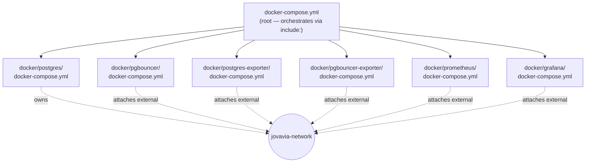

# Docker Compose Architecture

## Purpose

This stack is defined across seven Compose files, not one. This document explains the `include:`-based composition pattern the repository uses, why per-component files were chosen over a monolithic `docker-compose.yml`, and what that decomposition costs versus what it buys.

## Architecture



Each component directory under `docker/` is self-contained: its own `docker-compose.yml`, its own `conf/` subdirectory for mounted configuration, and — where needed — its own entrypoint scripts (`docker/pgbouncer/start-pgbouncer.sh`). The root `docker-compose.yml` contains no service definitions of its own; its entire content is the `include:` list.

## Configuration

```yaml
# docker-compose.yml (repository root)
include:
  # Database Layer
  - ./docker/postgres/docker-compose.yml
  - ./docker/pgbouncer/docker-compose.yml

  # Observability
  - ./docker/postgres-exporter/docker-compose.yml
  - ./docker/pgbouncer-exporter/docker-compose.yml
  - ./docker/prometheus/docker-compose.yml
  - ./docker/grafana/docker-compose.yml
```

`include:` is a Compose Specification feature (not a Docker-proprietary extension) that merges the referenced files into one logical project at parse time, as though their contents were concatenated — service names, networks, and volumes are resolved against the *combined* project, which is exactly what allows `docker/pgbouncer/docker-compose.yml` to reference the `jovavia-network` that a *different* file (`docker/postgres/docker-compose.yml`) actually defines (see [Networking](networking.md)).

Each component file follows the same internal shape — image, env, `depends_on`, `ports`, `volumes`, `networks` — for example, the observability sidecar pattern:

```yaml
# docker/postgres-exporter/docker-compose.yml
services:
  postgres-exporter:
    image: prometheuscommunity/postgres-exporter:v0.17.1
    restart: unless-stopped
    env_file: [../../.env]
    environment:
      DATA_SOURCE_URI: "${POSTGRES_HOST}:${POSTGRES_PORT}/jovavia_identity?sslmode=disable"
      DATA_SOURCE_USER: "${POSTGRES_USER}"
      DATA_SOURCE_PASS: "${POSTGRES_PASSWORD}"
    ports: ["${POSTGRES_EXPORTER_PORT}:9187"]
    networks: [jovavia-network]
networks:
  jovavia-network: { external: true, name: jovavia-network }
```

Every file also independently `env_file`s the same root `.env` (`../../.env` relative to each component directory) — there's one source of environment truth even though there are seven files consuming it (see [Environment Variables](../setup/environment-variables.md)).

## Operational Notes

**Why per-component files instead of one `docker-compose.yml` with six services in it:** at six services, a monolithic file would still be readable — this decomposition is optimized for what Sprint 0 is explicitly building toward, not just today's file count. Each component directory is a self-contained unit that can be understood, modified, and eventually migrated (to a Kubernetes manifest, a Helm subchart, or an independently-versioned module) without touching the other five. The cost is real and worth naming: cross-file dependencies (the network ownership pattern in [Networking](networking.md), `depends_on` conditions referencing services defined in a different file) are less discoverable than they'd be in one file, because `grep`-ing a single component's `docker-compose.yml` doesn't show you what depends on it or what it depends on unless you already know to look at the root `include:` list.

**File count grows linearly with components, and that's the intended shape.** Adding Redis, Kafka, Loki, Tempo, or OpenTelemetry Collector (all listed as aspirational in the repository README) means adding one more `docker/<component>/docker-compose.yml` and one more line to the root `include:` list — no existing file needs to change.

## Troubleshooting

**Compose says a service is defined twice.** Two component files defined a service with the same name — check for a copy-paste error in a new `docker/<component>/docker-compose.yml`, since `include:` will surface a duplicate-service error rather than silently picking one.

**Changes to a component file aren't taking effect.** Confirm you're running `docker compose` from the repository root (where the root `docker-compose.yml` with the `include:` directive lives) — running Compose commands from inside a `docker/<component>/` directory against that directory's file alone will not pick up cross-file network/dependency wiring, and can create a second, disconnected `jovavia-network` if run without `external: true` resolving correctly.

**A new component's file isn't being picked up at all.** Confirm it was added to the root `include:` list — this is the one manual step required whenever a new `docker/<component>/docker-compose.yml` is created; nothing auto-discovers files under `docker/`.

## Production Considerations

- This pattern assumes every component runs on the same host and shares one Compose project — appropriate for local development and single-node deployment, not for any environment where components need independent scaling, independent deploy cadences, or independent failure domains. That's precisely what the Kubernetes migration addresses structurally.
- `restart: unless-stopped` is set per-service but there's no resource limiting (`deploy.resources.limits`) anywhere in the stack — a runaway container on a shared development host can starve its neighbors. Low risk on a single developer's laptop, real risk the moment this runs on shared infrastructure.
- No `.dockerignore` or multi-stage build concerns apply here since every service uses an upstream published image — this stack builds nothing itself today, which also means there's no CI image-build pipeline to document yet.

## Future Improvements

- **Kubernetes migration path is close to 1:1**: each `docker/<component>/docker-compose.yml` becomes a Helm subchart or a Kustomize component — `environment:` becomes a ConfigMap/Secret, `volumes:` becomes a PVC or ConfigMap mount, `depends_on` conditions become init containers or readiness-gated Deployments, and `ports:` becomes a Service definition. The `include:` composition pattern itself maps conceptually to a Kubernetes umbrella Helm chart with subchart dependencies.
- Add a `Makefile` target per component (`make up-postgres`, `make up-observability`) now that the `Makefile` exists in the repo but is currently empty — see [Local Development Setup](../setup/local-development.md) Future Improvements.
- Consider Compose profiles (`profiles:` per service) to allow starting just the database layer without observability during fast local iteration, without needing separate compose invocations.

## Future Evolution

> Roadmap only — nothing in this section is implemented, scheduled, or scoped in detail yet.

- **Sprint 1**: Redis gets its own `docker/redis/docker-compose.yml`, added to the root `include:` list — no existing file changes, per the pattern this document describes.
- **Sprint 2**: Kafka, Loki, and Tempo follow the same one-directory-per-component shape.
- **Sprint 3**: Kubernetes migration — each `docker/<component>/docker-compose.yml` becomes a Helm subchart or Kustomize component, as already outlined in Future Improvements above, as part of the broader OCI deployment and multi-region HA push.
