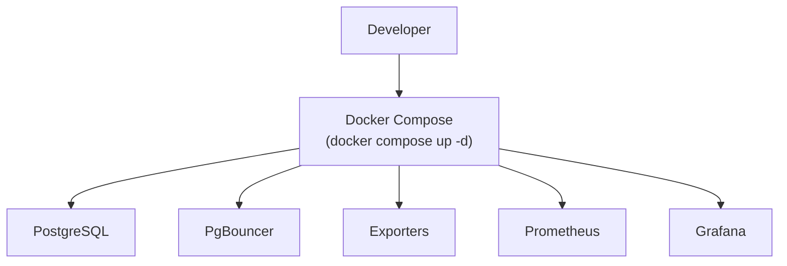
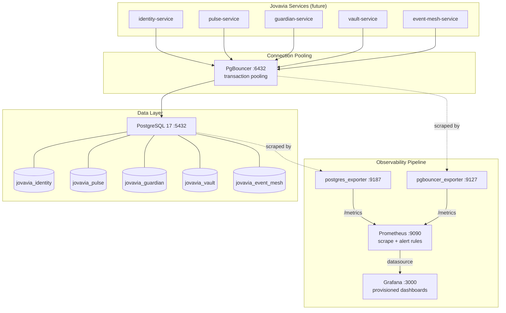

# Infrastructure Overview

> **Scope**: `infra-deployment` repository, branch `feature/infra-observability`, Sprint 0 — Infrastructure Foundation.
> **Audience**: Engineers onboarding onto Jovavia platform infrastructure, SREs, and reviewers evaluating the Sprint 0 foundation before it merges to `main`.

## At a Glance



One command, six services. The rest of this document — and the detailed diagram in Architecture below — fills in what each box actually does and why.

## Purpose

Sprint 0 exists to answer one question before any Jovavia service writes a line of business logic: **what does "the database" mean for this platform, and how do we know when it's unhealthy?** This document is the entry point for understanding the answer — a single logical PostgreSQL cluster, fronted by a connection pooler, with a metrics pipeline that makes its health observable from day one rather than bolted on after the first outage.

Everything else in `docs/` drills into one component. This document is the map: what exists, why it exists in this shape, and how the pieces fit together before you go read about any one of them in isolation.

## Architecture

Five databases, one PostgreSQL instance, one pooler, and a four-stage observability pipeline:



**Why one PostgreSQL instance holding five databases, not five instances:** at Sprint 0 scale, running five separate Postgres containers would multiply operational surface (five sets of connections, five backup jobs, five sets of resource limits) for no isolation benefit `pg_hba.conf` and role-based access control don't already provide at the database level within one instance. `bootstrap-postgres.sh` (see [Bootstrap Database](../setup/bootstrap-database.md)) creates `jovavia_identity`, `jovavia_pulse`, `jovavia_guardian`, `jovavia_vault`, and `jovavia_event_mesh` as five logical databases inside one PostgreSQL 17 server — real isolation (separate catalogs, separate connection namespaces, no cross-database queries by default) without the operational multiplication. This is a deliberate, revisitable choice — see **Future Improvements** below.

**Why PgBouncer sits between every service and Postgres, unconditionally:** PostgreSQL's per-connection cost (roughly 5–10MB of backend process memory, plus the overhead of process-per-connection under `max_connections`) means a fleet of stateless services each holding a connection pool of their own will exhaust `max_connections = 300` (see `postgresql.conf`) far before it exhausts actual query capacity. PgBouncer in transaction-pooling mode multiplexes many client connections onto few server connections. This decision is formalized in [ADR-0027: PgBouncer Connection Pooling Architecture](../adr/ADR-0027-pgbouncer-architecture.md) and explained mechanically in [Connection Pooling & PgBouncer (Reference)](../concepts/connection-pooling-and-pgbouncer.md).

**Why the observability pipeline is four hops, not a direct Grafana-to-Postgres connection:** Grafana can query PostgreSQL directly via a SQL datasource, but that couples dashboard rendering to production query load and gives you point-in-time values, not a time series you can alert on or look back through after an incident. The exporter → Prometheus → Grafana chain trades one extra hop for a durable, queryable metrics history and a system (Prometheus) whose entire job is alerting on trends, not answering ad hoc queries under load. Full reasoning in [Observability](observability.md) and [ADR-0031: Metrics Exporters (postgres_exporter, pgbouncer_exporter)](../adr/ADR-0031-metrics-exporters.md).

## Configuration

The entire stack is defined declaratively and composed via Docker Compose's `include:` directive from the repository root:

```yaml
# docker-compose.yml
include:
  # Database Layer
  - ./docker/postgres/docker-compose.yml
  - ./docker/pgbouncer/docker-compose.yml

  # Observability
  - ./docker/postgres-exporter/docker-compose.yml
  - ./docker/pgbouncer-exporter/docker-compose.yml
  - ./docker/prometheus/docker-compose.yml
  - ./docker/grafana/docker-compose.yml
```

Six services, one `docker compose up -d`. The full rationale for this file-per-component composition (rather than one monolithic `docker-compose.yml`) is in [Docker Compose Architecture](docker-compose-architecture.md). Every service is versioned with a pinned image tag — no `:latest` anywhere in this stack:

| Component | Image | Version |
|---|---|---|
| PostgreSQL | `postgres` | `17` |
| PgBouncer | `edoburu/pgbouncer` | `v1.24.1-p1` |
| PostgreSQL Exporter | `prometheuscommunity/postgres-exporter` | `v0.17.1` |
| PgBouncer Exporter | `prometheuscommunity/pgbouncer-exporter` | `v0.11.0` |
| Prometheus | `prom/prometheus` | `v3.5.0` |
| Grafana | `grafana/grafana` | `12.2.0` |

## Operational Notes

All six services share one Docker network, `jovavia-network`. `docker/postgres/docker-compose.yml` is the only file that *creates* this network; every other compose file declares it `external: true` and depends on it already existing — meaning Postgres's compose file must be part of any startup that includes downstream services. See [Networking](networking.md) for the full dependency chain and what breaks if a service is started in isolation.

Startup ordering matters and is partially, but not fully, enforced: `pgbouncer` waits on `postgres`'s `service_healthy` condition; `pgbouncer-exporter` waits on `pgbouncer`'s `service_started` (not `service_healthy`); `postgres-exporter`, `prometheus`, and `grafana` have `depends_on` relationships that gate on container start, not application readiness, for their upstream dependency. In practice this means a `docker compose up -d` from a cold start can show Prometheus and Grafana as "running" before their scrape targets are actually serving metrics — transient `context deadline exceeded` scrape errors in the first 10–15 seconds are expected, not a fault.

## Troubleshooting

**"Nothing works after `docker compose up -d`"** — check `docker compose ps`. If `postgres` isn't `healthy`, nothing downstream will function correctly regardless of what its logs say, because `pg_hba.conf` and `postgresql.conf` are mounted read-only from `docker/postgres/conf/` and a syntax error there fails the container silently into a restart loop. Start with `docker compose logs postgres`.

**"Services can't reach each other"** — almost always the `jovavia-network` external-network ordering problem. See [Networking](networking.md) Troubleshooting.

**"I ran one component's compose file directly and it failed"** — e.g. `docker compose -f docker/grafana/docker-compose.yml up`. This fails today because `jovavia-network` won't exist unless Postgres's compose file has already run. Always bring the stack up from the root `docker-compose.yml`, or use the (not-yet-added, see Future Improvements) per-component Makefile targets.

## Production Considerations

This Sprint 0 foundation is explicitly a **local, single-node development stack**, and several of its defaults are correct for that purpose and wrong for anything beyond it:

- `pg_hba.conf` accepts `scram-sha-256` authentication from `0.0.0.0/0` — safe only because Docker's bridge network isn't reachable from outside the host by default. This must not survive a move to a shared or cloud environment unchanged — see [PostgreSQL Runbook](../runbooks/postgres-runbook.md) Production Considerations.
- PgBouncer's client-facing credential is generated at container startup from `POSTGRES_PASSWORD` (`userlist.template` → `/tmp/userlist.txt`, never committed to source control) — see [PgBouncer Runbook](../runbooks/pgbouncer-runbook.md). The remaining risk is that `.env` itself holds that password in plaintext, same as every other credential in this stack.
- `GRAFANA_ADMIN_PASSWORD` defaults to `admin` in `.env.example`. Every environment beyond a developer's laptop needs this rotated and sourced from a secrets manager, not a `.env` file.
- Prometheus has alerting rules but no Alertmanager — an alert firing today is only visible to someone actively looking at the Prometheus UI. See [ADR-0033: Prometheus Alerting Rules](../adr/ADR-0033-prometheus-alerting.md).

None of these are blockers for Sprint 0's stated goal (a working local foundation); all of them are blockers for the next environment this stack is deployed into.

## Future Improvements

- **Kubernetes migration.** This entire Compose topology is designed to translate cleanly: each `docker/<component>/docker-compose.yml` maps to a Deployment/StatefulSet + Service + ConfigMap, `jovavia-network` becomes a Kubernetes Service DNS namespace, and the exporter sidecar pattern is already container-per-concern, which is how Kubernetes expects it. The one component that needs real redesign, not just translation, is PgBouncer's config templating (`eval`-based heredoc substitution — see [PgBouncer Runbook](../runbooks/pgbouncer-runbook.md)), which should become a Kubernetes ConfigMap + `envsubst` init container or a proper templating tool before this moves.
- **Alertmanager.** Wire the existing `alert.rules.yml` rules to a real notification channel — see [ADR-0033: Prometheus Alerting Rules](../adr/ADR-0033-prometheus-alerting.md) Future Improvements for the concrete plan.
- **Secrets management.** Replace `.env`-file credentials (Postgres password, PgBouncer userlist, Grafana admin password) with a mounted secrets provider (Vault, Kubernetes Secrets, or cloud-native equivalent) as soon as this stack leaves a single developer's machine.
- **Per-database exporters or multi-target scraping**, if the five Jovavia databases develop meaningfully different load profiles worth alerting on independently rather than as one instance.
- **Horizontal read scaling** (read replicas) once traffic profiles from actual Jovavia services exist to justify it — premature today, a near-certain Sprint N+ need given `wal_level = replica` and `hot_standby = on` are already set in `postgresql.conf`, i.e. replication-ready by design even though nothing replicates yet.

## Future Evolution

> Roadmap only — nothing in this section is implemented, scheduled, or scoped in detail yet. It exists to set expectations about direction, not to commit to dates or designs. See Future Improvements above for work that's already scoped against the current implementation.

- **Sprint 1**: Redis, a Redis Exporter following the same pattern as `postgres_exporter`/`pgbouncer_exporter`, and Alertmanager to close the alerting gap recorded in [ADR-0033](../adr/ADR-0033-prometheus-alerting.md).
- **Sprint 2**: Kafka, Loki (log aggregation), and Tempo (distributed tracing) — extending the observability pipeline beyond metrics.
- **Sprint 3**: Kubernetes migration, OCI deployment, and multi-region high availability.
