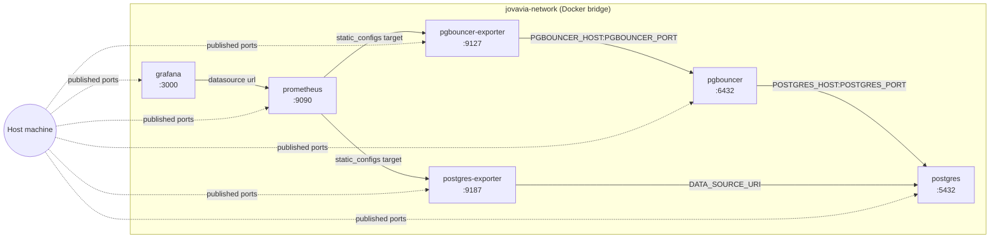

# Networking

## Purpose

Every component in this stack talks to every other component over one Docker bridge network, `jovavia-network`. This document explains why there's exactly one network rather than one per tier, how service discovery works with no explicit configuration anywhere, and — the part that actually causes incidents — why the network's ownership model creates a real startup-ordering dependency between compose files.

## Architecture



**Service discovery is entirely DNS-based, entirely implicit.** No service in this stack hardcodes an IP address anywhere. Docker's embedded DNS resolves each service's Compose service name (`postgres`, `pgbouncer`, `postgres-exporter`, `pgbouncer-exporter`, `prometheus`, `grafana`) to that container's current IP on `jovavia-network`. This is why `POSTGRES_HOST=postgres` in `.env` works identically whether Postgres is on its first run or its fiftieth restart with a new IP — every consumer resolves the name fresh, every connection.

**Why `jovavia-network` exists as one externally-declared network rather than letting Compose create its own per file.** By default, `docker compose up` creates one bridge network scoped to the *Compose project* it's invoked from — normally derived from the directory name or an explicit `-p`/`COMPOSE_PROJECT_NAME`. Because this stack's root `docker-compose.yml` runs `include:` across six separate `docker/<component>/docker-compose.yml` files as a single logical project (see [Docker Compose Architecture](docker-compose-architecture.md)), a naive per-file network would still just be one network for the merged project — the real risk this design avoids is a *component* file being run in isolation (`docker compose -f docker/prometheus/docker-compose.yml up`, say, while iterating on one service) and Compose silently creating a second, disconnected, project-scoped bridge network that shares nothing with the one the rest of the stack is actually using. Declaring `jovavia-network` once, by name, in `docker/postgres/docker-compose.yml`, and having every other file attach to that exact named network via `external: true`, means:

- the network is **created once**, by whichever compose invocation includes Postgres's file first;
- it is **shared by every compose module** regardless of which subset of files a given `docker compose` invocation happens to include;
- **service discovery works uniformly** — every container's Compose service name resolves via Docker's embedded DNS to any other container on the same named network, with no per-invocation ambiguity about which network that is;
- and it **prevents the duplicate-bridge-network failure mode** described above — `external: true` makes Compose fail loudly (`network jovavia-network declared as external, but could not be found`) instead of silently creating a disconnected network when a downstream file is run without Postgres's file having created `jovavia-network` first.

**Every port is published to the host, not just exposed internally.** `ports: ["${X_PORT}:${X_PORT}"]` (or `:5432`, `:9090`, etc. internally) appears on every service. This is a deliberate Sprint 0 choice for developer ergonomics — `psql -h localhost -p 5432`, Prometheus's UI, and Grafana's UI are all reachable directly from the host without exec-ing into a container. It is also a decision that needs revisiting before any shared or cloud environment (see Production Considerations).

## Configuration

The network is declared twice, with opposite ownership semantics — this is the single most important networking detail in the entire stack:

```yaml
# docker/postgres/docker-compose.yml — CREATES the network
networks:
  jovavia-network:
    name: jovavia-network
```

```yaml
# docker/pgbouncer/docker-compose.yml (and every other downstream file) — ATTACHES to it
networks:
  jovavia-network:
    external: true
    name: jovavia-network
```

`external: true` tells Compose "this network must already exist — do not create it, fail if it's missing." Only `docker/postgres/docker-compose.yml` omits that flag, making it the network's sole owner. Every other one of the six compose files — `pgbouncer`, `postgres-exporter`, `pgbouncer-exporter`, `prometheus`, `grafana` — declares `external: true`.

Port map, from `.env.example`:

| Service | Container port | Host port (env var) |
|---|---|---|
| PostgreSQL | 5432 | `POSTGRES_PORT` (5432) |
| PgBouncer | `${PGBOUNCER_PORT}` | `PGBOUNCER_PORT` (6432) |
| PostgreSQL Exporter | 9187 | `POSTGRES_EXPORTER_PORT` (9187) |
| PgBouncer Exporter | 9127 | `PGBOUNCER_EXPORTER_PORT` (9127) |
| Prometheus | 9090 | `PROMETHEUS_PORT` (9090) |
| Grafana | 3000 | `GRAFANA_PORT` (3000) |

## Operational Notes

Because `include:` in the root `docker-compose.yml` merges all six files into a single logical Compose project, `docker compose up -d` from the repository root works correctly regardless of file ownership order — Compose resolves the full merged project graph before creating anything, so `jovavia-network` is created once (by the definition in `docker/postgres/docker-compose.yml`) and every other service attaches to that same network object. **This only works because the root command always includes all six files together.**

Every downstream service that depends on Postgres for actual data access also has an explicit `depends_on` with a health or start condition (see [Infrastructure Overview](infrastructure-overview.md) Operational Notes) — but the network dependency is separate from and stricter than the service dependency. A container can fail to start due to missing network before `depends_on` conditions are ever evaluated.

## Troubleshooting

**`network jovavia-network declared as external, but could not be found`** — you started a downstream compose file in isolation (e.g. `docker compose -f docker/prometheus/docker-compose.yml up`) without Postgres's file ever having run in this Docker context. Fix: `docker compose up -d` from the repository root, which includes all six files together and satisfies the ownership dependency automatically. If you need to iterate on one service repeatedly, bring the whole stack up once, then use `docker compose up -d --no-deps <service>` to restart just that one service against the already-existing network.

**A service can't resolve another service's hostname** — confirm both containers are actually attached to `jovavia-network`, not a different network Compose may have auto-created (this happens if a component's compose file is run standalone and doesn't yet fail on the missing external network — check `docker network inspect jovavia-network` for actual member containers versus what you expect).

**Grafana's Prometheus datasource shows "bad gateway" or connection refused** — the datasource URL is hardcoded to `http://prometheus:9090` (see `docker/grafana/provisioning/datasources/prometheus.yml`), which only resolves inside `jovavia-network`. If Grafana is somehow not on that network, or Prometheus's container name differs from `prometheus` (e.g., a manual `container_name` override), this breaks. Confirm with `docker compose exec grafana getent hosts prometheus`.

## Production Considerations

- **Publishing every port to the host is a local-development-only pattern.** In any shared environment, exposing PostgreSQL (5432), PgBouncer (6432), and the Prometheus/Grafana UIs directly to a routable host interface is an unnecessary attack surface. Production/staging should publish only what genuinely needs external reachability (typically just Grafana, behind auth and TLS) and keep the rest reachable only within the private network.
- **One flat network for every tier** (database, pooling, observability) means a compromised exporter container has network-level reachability to PostgreSQL and PgBouncer directly. At Sprint 0 scale this is an acceptable simplification; a production topology should segment observability (which only needs to *scrape*, not connect with database credentials) from the data tier, e.g. via Docker network policies or, post-Kubernetes-migration, NetworkPolicy resources.
- **The `external: true` / owner-file pattern doesn't generalize past Docker Compose.** It's worth understanding now (see [Docker Compose Networking (Reference)](../concepts/docker-compose-networking.md)) precisely because it disappears entirely in Kubernetes, where Services and DNS are namespace-scoped and there's no equivalent "one file must run first" ordering constraint — this is one of the few genuine simplifications Kubernetes migration provides over this stack's current design.

## Future Improvements

- Introduce network segmentation: a `data-network` for Postgres↔PgBouncer↔exporters, and a separate `observability-network` for Prometheus↔Grafana, with only the exporters bridging both.
- Stop publishing PostgreSQL and PgBouncer ports to the host outside local development; gate behind a bastion or VPN-only access pattern for any shared environment.
- Add TLS between PgBouncer and PostgreSQL, and between exporters and their targets, once this stack leaves a single trusted host — currently everything is plaintext, which is standard and low-risk for same-host Docker networking but not acceptable across real network boundaries.
- On Kubernetes migration, replace the network-ownership dependency entirely with Kubernetes-native Service discovery and NetworkPolicy, and drop the `external: true` pattern altogether — see [Docker Compose Networking (Reference)](../concepts/docker-compose-networking.md) Future Improvements.

## Future Evolution

> Roadmap only — nothing in this section is implemented, scheduled, or scoped in detail yet.

- **Sprint 1**: Redis joins `jovavia-network` the same way every current service does — no networking redesign needed for it specifically.
- **Sprint 2**: Kafka, Loki, and Tempo join the same network; this is likely the point where the network-segmentation Future Improvement above (separating data-tier from observability-tier traffic) stops being optional.
- **Sprint 3**: Kubernetes migration replaces `jovavia-network` and the `external: true` ownership pattern with namespace-scoped Service discovery, as part of the broader OCI deployment and multi-region HA push.
