# Observability

## Purpose

"It's running" and "it's healthy" are different claims, and this document covers the pipeline that lets us tell them apart: two exporters translating database-native state into Prometheus's metrics format, Prometheus scraping and evaluating alert rules against that state, and Grafana rendering it for a human. It also documents, honestly, where that pipeline currently stops short of being operationally complete — an alert with nowhere to go is not yet an alerting system.

## Architecture

```mermaid
flowchart LR
    PG[(PostgreSQL 17)] -->|SQL queries via\nDATA_SOURCE_URI| PGE[postgres_exporter :9187]
    PB[PgBouncer] -->|SHOW commands via\nadmin connection| PBE[pgbouncer_exporter :9127]

    PGE -->|GET /metrics\nevery 15s| Prom[Prometheus :9090]
    PBE -->|GET /metrics\nevery 15s| Prom

    Prom -->|evaluate every 15s| Rules[alert.rules.yml\n4 rules]
    Rules -->|firing alerts| PromUI["Prometheus UI /alerts\n(nowhere else — no Alertmanager)"]

    Prom -->|PromQL queries| Graf[Grafana :3000]
    Graf --> D1[Jovavia PostgreSQL Dashboard]
    Graf --> D2[pgbouncer-overview dashboard]

    style PromUI fill:#4a1f1f,stroke:#a33
```



Each exporter is a **translation layer, not a data store**: `postgres_exporter` connects to PostgreSQL with a normal SQL connection and runs a fixed set of introspection queries (`pg_stat_database`, `pg_stat_activity`, `pg_settings`, `pg_locks`, and more) on every scrape, converting rows into Prometheus's `metric_name{labels} value` format. `pgbouncer_exporter` does the equivalent against PgBouncer's admin console (`SHOW POOLS`, `SHOW STATS`, `SHOW DATABASES` — PgBouncer exposes these as a virtual `pgbouncer` database queryable over the normal Postgres wire protocol). Neither exporter retains history; Prometheus is the only component in this pipeline with a time series database.

## Configuration

**Scrape configuration** (`docker/prometheus/conf/prometheus.yml`):

```yaml
global:
  scrape_interval: 15s
  evaluation_interval: 15s

rule_files:
  - /etc/prometheus/alert.rules.yml

scrape_configs:
  - job_name: postgres
    static_configs:
      - targets:
          - postgres-exporter:9187

  - job_name: pgbouncer
    static_configs:
      - targets:
          - pgbouncer-exporter:9127
```

Both scrape jobs use `static_configs` with hardcoded hostnames — appropriate for a two-target, single-host Compose deployment, and precisely the piece that needs to change first on Kubernetes migration (see Future Improvements).

**Alert rules** (`docker/prometheus/conf/alert.rules.yml`), four rules across two groups:

```yaml
groups:
  - name: postgres.rules
    rules:
      - alert: PostgreSQLDown
        expr: pg_up == 0
        for: 1m
        labels: { severity: critical }
      - alert: PostgreSQLTooManyConnections
        expr: pg_stat_activity_count > 80
        for: 2m
        labels: { severity: warning }
  - name: pgbouncer.rules
    rules:
      - alert: PgBouncerDown
        expr: pgbouncer_up == 0
        for: 1m
        labels: { severity: critical }
      - alert: PgBouncerPoolSaturation
        expr: pgbouncer_pools_client_waiting_connections > 10
        for: 2m
        labels: { severity: warning }
```

Full mechanical explanation of `for:`, label semantics, and how these rules evaluate is in [Prometheus & PromQL (Reference)](../concepts/prometheus-and-promql.md). The specific threshold choices (why 80, why 10) and the alerting gap are covered in [ADR-0033: Prometheus Alerting Rules](../adr/ADR-0033-prometheus-alerting.md).

**Datasource wiring** (`docker/grafana/provisioning/datasources/prometheus.yml`) points Grafana at Prometheus with zero manual UI configuration required — Grafana provisions this datasource on container start, every time, from file:

```yaml
apiVersion: 1
datasources:
  - name: Prometheus
    uid: prometheus
    type: prometheus
    access: proxy
    url: http://prometheus:9090
    isDefault: true
    editable: false
```

## Operational Notes

**Two dashboards ship today, and both are purpose-built for this deployment.** `jovavia-postgres-overview.json` (`docker/grafana/dashboards/postgres/jovavia-postgres-overview.json`) is the Jovavia PostgreSQL Dashboard — built directly against this stack's own metric set rather than imported from an external source. `pgbouncer-overview.json` is the equivalent for PgBouncer (tagged `jovavia`, `pgbouncer`) and is the one referenced as the "Custom Jovavia PgBouncer dashboard" in the Sprint 0 scope.

> **Dashboard Compatibility Note.** Grafana's community PostgreSQL dashboard (Grafana.com ID `9628`) was evaluated for this role and not adopted: its template variables depend on `release` and `kubernetes_namespace` labels that only exist when `postgres_exporter` is deployed via its Kubernetes Helm chart — labels a Docker Compose deployment never produces. Jovavia replaced it with `jovavia-postgres-overview.json`, built directly against plain `static_configs`-based metric labels. The current dashboard is verified compatible with `prometheuscommunity/postgres-exporter:v0.17.1` (the pinned exporter version — see Configuration in [Infrastructure Overview](infrastructure-overview.md)) running under Docker Compose.

**Metric cardinality is deliberately low.** `postgres_exporter` connects via `DATA_SOURCE_URI` pointed at `jovavia_identity` specifically, but `pg_stat_database` and related catalog views are cluster-wide, not database-scoped — connecting to one database is sufficient to see stats for all five Jovavia databases (`jovavia_pulse`, `jovavia_guardian`, `jovavia_vault`, `jovavia_event_mesh` included), because the query targets system catalogs visible to any authenticated connection with sufficient privilege, not `jovavia_identity`'s own data.

## Troubleshooting

**The PostgreSQL dashboard shows "No data" on every panel.** This was a known issue with the community dashboard evaluated and rejected for this role — see the Dashboard Compatibility Note above. `jovavia-postgres-overview.json`'s template variables (e.g. `label_values(pg_up, instance)`) don't have that dependency, so this specific failure mode no longer applies. If you still see "No data," treat it as an actual scrape or query problem — check `pg_up` directly in Prometheus's `/graph` UI before assuming a dashboard-variable issue.

**An alert is firing but nobody was notified.** Expected — see Production Considerations below. Check `http://localhost:9090/alerts` directly; there is no other notification path today.

**Grafana dashboard doesn't appear in the expected folder.** See [Grafana Runbook](../runbooks/grafana-runbook.md) — this is the `foldersFromFilesStructure` behavior, documented fully in [ADR-0032: Grafana Provisioning (File-Based, Not UI/API)](../adr/ADR-0032-grafana-provisioning.md).

**`pgbouncer_up` or `pg_up` is `0`.** Confirms the exporter can't reach its target — check the exporter's own logs first (`docker compose logs postgres-exporter` / `pgbouncer-exporter`), then the target's health directly, before assuming a Prometheus-side problem.

## Production Considerations

- **No Alertmanager is deployed.** `alert.rules.yml`'s four rules evaluate and populate Prometheus's `/alerts` page, but nothing routes a firing alert to Slack, PagerDuty, email, or anywhere a human would see it without actively checking the Prometheus UI. This is the single largest observability gap in Sprint 0 — see [ADR-0033: Prometheus Alerting Rules](../adr/ADR-0033-prometheus-alerting.md) for the full analysis and remediation plan.
- **15-day retention** (`PROMETHEUS_RETENTION=15d`) is reasonable for local development and incident review, but undersized for capacity planning or trend analysis in production — most teams retain 30–90 days locally and ship to long-term storage (Thanos, Mimir, or a managed equivalent) beyond that.
- **Both dashboards are now Jovavia-authored and Compose-native**, so correctness is fully within the project's own control — there's no longer an upstream community dashboard whose template-variable assumptions can drift out from under this deployment.
- **Both exporters authenticate with the same plaintext credentials** documented as a concern in [PgBouncer Runbook](../runbooks/pgbouncer-runbook.md) and [PostgreSQL Runbook](../runbooks/postgres-runbook.md) — the observability pipeline inherits every credential-handling gap in the data layer it observes.

## Future Improvements

- Deploy Alertmanager, route `severity: critical` to a paging channel and `severity: warning` to a non-paging channel — concrete config in [ADR-0033: Prometheus Alerting Rules](../adr/ADR-0033-prometheus-alerting.md).
- Move from `static_configs` to Kubernetes service discovery (`kubernetes_sd_configs`) as part of the Kubernetes migration — this is a drop-in replacement for the `scrape_configs` block with no changes needed to the exporters themselves.
- Add recording rules for expensive or frequently-dashboarded PromQL expressions (e.g., pool utilization percentage, currently computed live in every Grafana panel refresh) to reduce Prometheus query load as dashboard usage grows.
- Extend the exporter/scrape pattern to every future Jovavia service — this pipeline is the template, not a one-off for the data layer.

## Future Evolution

> Roadmap only — nothing in this section is implemented, scheduled, or scoped in detail yet.

- **Sprint 1**: A Redis Exporter, scraped the same way `postgres_exporter`/`pgbouncer_exporter` are today, and Alertmanager to finally route the four existing alert rules (plus whatever Redis-specific rules follow) to a human.
- **Sprint 2**: Loki for log aggregation and Tempo for distributed tracing, extending this pipeline from metrics-only to the fuller three-pillars observability picture, alongside Kafka.
- **Sprint 3**: Kubernetes migration — `static_configs` becomes `kubernetes_sd_configs` (already called out in Future Improvements above) as part of the broader OCI deployment and multi-region HA effort.
