# Connection Pooling & PgBouncer (Reference)

> **Concept bible** — durable reference material. The pooling mode taxonomy and protocol-level mechanics here apply to any PgBouncer deployment, not just Jovavia's.

## Purpose

Connection pooling is one of those topics everyone nods along to and few can explain at the protocol level when asked "what exactly does a pooler do between a client's query and Postgres." This document is that explanation — durable enough to answer the question correctly regardless of what Jovavia's specific pool sizes happen to be at any given time.

## Architecture

**The core problem pooling solves:** PostgreSQL connections are expensive processes (see [PostgreSQL Internals (Reference)](postgresql-internals.md)), but application connection patterns are typically short bursts of activity (a request, a transaction) followed by idle time. Without pooling, that idle time still holds a full backend process open, doing nothing. A pooler's job is to multiplex many logical client connections onto few actual server connections, exploiting the gap between "connections held" and "connections actively doing work."

**The three pooling modes**, precisely:

```mermaid
sequenceDiagram
    participant C as Client
    participant PB as PgBouncer
    participant S as Server connection

    rect rgb(40,40,60)
    Note over C,S: Session pooling
    C->>PB: connect
    PB->>S: assign server connection
    Note over S: held for entire client session
    C->>PB: disconnect
    PB->>S: release
    end

    rect rgb(60,40,40)
    Note over C,S: Transaction pooling (Jovavia's mode)
    C->>PB: BEGIN...COMMIT
    PB->>S: assign for this transaction only
    S-->>PB: release immediately after COMMIT
    Note over S: available for a DIFFERENT client now
    end

    rect rgb(40,60,40)
    Note over C,S: Statement pooling
    C->>PB: single statement
    PB->>S: assign for this statement only
    S-->>PB: release immediately after statement
    Note over S: maximum multiplexing, breaks multi-statement transactions
    end
```



- **Session pooling** — a server connection is bound to a client for the client's entire connected session (until disconnect). Safest (full compatibility with every Postgres session feature — prepared statements, session-level `SET`, advisory locks) but the least resource-efficient; barely better than no pooling if clients hold long-lived connections.
- **Transaction pooling** — a server connection is bound only for the duration of one transaction (`BEGIN`...`COMMIT`/`ROLLBACK`, or a single implicit-transaction statement), returned to the pool the instant that transaction ends. High multiplexing efficiency; breaks session-level state that must persist *across* transactions (prepared statements not re-issued per-transaction, session-level `SET` instead of `SET LOCAL`, session-scoped advisory locks). Jovavia's chosen mode — see [ADR-0027: PgBouncer Connection Pooling Architecture](../adr/ADR-0027-pgbouncer-architecture.md) for the specific reasoning.
- **Statement pooling** — a server connection is bound only for a single statement, released immediately after. Maximum multiplexing; breaks multi-statement transactions entirely (a `BEGIN` and its subsequent statements could land on different server connections). Rarely used for general application workloads.

**What actually gets pooled — the wire protocol layer.** PgBouncer speaks the PostgreSQL frontend/backend wire protocol on both sides: it looks like a real Postgres server to clients, and it looks like a real Postgres client to the actual server. This is why applications need zero code changes to use PgBouncer — connection strings just point at PgBouncer's host/port instead of Postgres's, and every standard `libpq`-based driver works unmodified.

## Configuration

The canonical PgBouncer settings, and what they actually bound:

```ini
pool_mode = transaction
max_client_conn = 5000        # ceiling on CLIENT-facing connections PgBouncer will accept
default_pool_size = 50        # ceiling on SERVER connections, PER database/user pair
reserve_pool_size = 20        # additional burst capacity beyond default_pool_size
reserve_pool_timeout = 5      # seconds a client waits before reserve pool activates
query_wait_timeout = 120      # max seconds a client waits for a server connection at all
server_idle_timeout = 300     # seconds an idle SERVER connection is closed
server_lifetime = 3600        # max seconds any server connection lives, regardless of activity
```

The critical relationship: `max_client_conn` (5000) can be far larger than `default_pool_size` (50) precisely *because* pooling exists — thousands of clients can be "connected" to PgBouncer simultaneously while only a few dozen are actually holding a server-side Postgres connection at any instant, because most of those thousands are idle between transactions.

## Operational Notes

**Reading `SHOW POOLS` output** (see [PgBouncer Runbook](../runbooks/pgbouncer-runbook.md)) — the four connection counts that matter:

| Column | Meaning |
|---|---|
| `cl_active` | Clients currently assigned a server connection, actively in a transaction |
| `cl_waiting` | Clients waiting for a server connection to free up — sustained non-zero here means the pool is saturated |
| `sv_active` | Server connections currently in use by a client |
| `sv_idle` | Server connections open but not currently assigned — pooling's "savings" made visible |

A healthy pool under load looks like `cl_active` fluctuating with traffic, `cl_waiting` at or near zero, and `sv_active + sv_idle` staying well under `default_pool_size`. Sustained `cl_waiting > 0` is the single clearest pool-saturation signal, which is exactly what Jovavia's `PgBouncerPoolSaturation` alert rule watches (see [ADR-0033: Prometheus Alerting Rules](../adr/ADR-0033-prometheus-alerting.md)).

## Troubleshooting

**"Prepared statement does not exist" errors under transaction pooling.** The client driver issued a server-side prepared statement expecting it to persist across transactions/connections — under transaction pooling, the underlying server connection can change between transactions, invalidating any prepared statement tied to the previous one. Fix at the driver/ORM level: disable server-side prepared statement caching, or use client-side (protocol-level "simple query" or client-side parameter substitution) prepared statements instead.

**A `SET` statement's effect disappears unexpectedly.** Session-level `SET` (e.g., `SET statement_timeout = '5s'`) persists only as long as the underlying server connection is bound to that client — under transaction pooling, that's until the next `COMMIT`. Use `SET LOCAL` inside an explicit transaction instead, which is transaction-scoped by design and pooling-safe.

**Advisory locks behave unexpectedly (released early, or held by the wrong "session").** Session-scoped advisory locks (`pg_advisory_lock`, not `pg_advisory_xact_lock`) assume the server connection persists for the application's logical session — under transaction pooling this assumption is false. Use transaction-scoped advisory locks (`pg_advisory_xact_lock`) instead, which are released automatically at transaction end and match transaction pooling's actual guarantees.

## Production Considerations

- Pool sizing (`default_pool_size`, `reserve_pool_size`) is a capacity-planning exercise that needs real traffic data to get right — undersized pools cause `query_wait_timeout` failures under legitimate load; oversized pools defeat the purpose of pooling by allowing too many concurrent server connections, re-approaching Postgres's `max_connections` ceiling.
- Transaction pooling's session-feature incompatibilities are an application-wide constraint, not a PgBouncer configuration concern — every service author needs to know this mode is in use, or debugging session-state bugs becomes a recurring, confusing tax on every team touching the database.
- PgBouncer itself is a single process (per instance) — it does not parallelize across CPU cores by default in older versions; verify the deployed version's threading/process model matches expected throughput needs at scale (newer PgBouncer releases have improved multi-core support; check the specific pinned version's capabilities).

## Future Improvements

- Document transaction-pooling constraints in a shared engineering guide referenced by every Jovavia service's onboarding docs, not just infrastructure docs — this is an application-code-affecting constraint, not purely an ops concern.
- Evaluate `auth_query`-based authentication (see [PgBouncer Runbook](../runbooks/pgbouncer-runbook.md)) to eliminate static credential file drift.
- Revisit pool sizing with real production traffic data once available, replacing today's reasonable-guess defaults with measured values.
