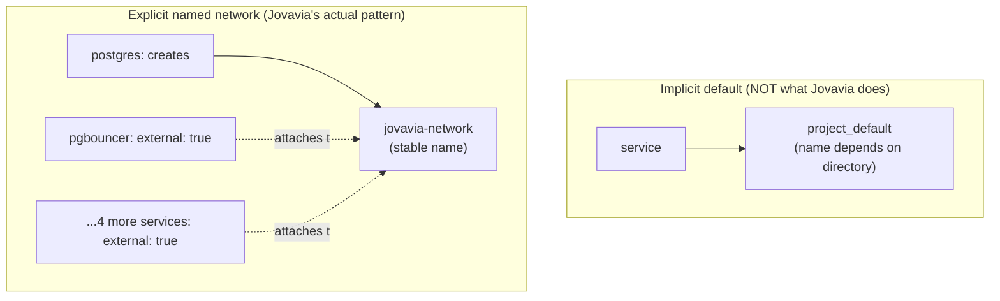

# Docker Compose Networking (Reference)

> **Concept bible** — durable reference material on Docker Compose's networking model generally, illustrated with Jovavia's `jovavia-network` as the worked example.

## Purpose

The `external: true` / network-ownership pattern documented operationally in [Networking](../architecture/networking.md) is an instance of a general Docker Compose networking mechanism worth understanding on its own terms — this document is that general explanation, useful for reasoning about any Compose networking question, not just this stack's specific one.

## Architecture

**Every Compose project gets a default network, unless told otherwise.** Without any explicit `networks:` configuration, `docker compose up` creates one bridge network per project (named `<project>_default`) and attaches every service to it automatically. Jovavia's stack overrides this default entirely — every component explicitly declares `jovavia-network`, giving it a stable, predictable name rather than one derived from the directory Compose happens to be run from (which is what `<project>_default` naming depends on, and is exactly the kind of accidental coupling explicit naming avoids).



**DNS-based service discovery is automatic and requires zero configuration.** Every container on a shared Compose network can resolve every other container by its service name via Docker's embedded DNS server — this is why `POSTGRES_HOST=postgres` just works: `postgres` isn't a hostname anyone configured at the OS level, it's resolved dynamically by Docker's DNS against the current network membership, correctly even after the target container restarts and gets a new internal IP.

**`external: true` is Compose's way of saying "don't manage this network's lifecycle."** Normally, Compose creates networks it defines and can remove them on `docker compose down`. Marking a network `external: true` tells Compose "this network is managed elsewhere — attach to it if it exists, and error if it doesn't; never create or destroy it as part of this project's lifecycle." Multiple Compose files/projects can safely share one externally-managed network this way, which is exactly Jovavia's use case: six separate Compose files (via `include:`), one shared network, one file responsible for actually owning it.

## Configuration

```yaml
# The OWNING file — creates the network as part of ITS lifecycle
networks:
  jovavia-network:
    name: jovavia-network      # explicit name, not Compose-project-derived

# Every OTHER file — attaches to a network it assumes already exists
networks:
  jovavia-network:
    external: true
    name: jovavia-network
```

Both blocks reference the same `name: jovavia-network` — that's what makes them resolve to the *same* Docker network object rather than two independently-named ones that happen to share a YAML key.

## Operational Notes

Port publishing (`ports:`) and network attachment are independent concerns: attaching to `jovavia-network` makes a container reachable by other containers *on that network* via its service name; `ports: ["6432:6432"]` additionally makes it reachable from the Docker host machine itself (and, if the host's firewall allows it, from outside the host) via `localhost:6432` or the host's IP. A service could be network-attached without any published ports (fully internal, reachable only by other containers) — none of Jovavia's services currently do this; every one publishes to the host for local development convenience (see [Networking](../architecture/networking.md) Production Considerations for why that changes outside local dev).

## Troubleshooting

**`network <name> declared as external, but could not be found`.** The owning Compose file's project hasn't been run yet in this Docker context — the `external: true` file has no way to create what it depends on. Fix: ensure the owning file is included in whatever `docker compose up` command runs (Jovavia's root `docker-compose.yml`'s `include:` list guarantees this when run from the repository root).

**Two services on "the same network" can't reach each other.** Confirm with `docker network inspect jovavia-network` that both containers are actually listed as connected — a typo in a network name (e.g. `jovavia_network` with an underscore instead of a hyphen) creates a *second*, different network silently, and Compose won't warn about the near-miss name.

**A network persists after `docker compose down`.** Expected for `external: true` networks — they're explicitly excluded from the owning project's teardown lifecycle by design. To actually remove `jovavia-network`, use `docker network rm jovavia-network` directly, and only after every attached container has been removed.

## Production Considerations

- The single-owning-file pattern is a Compose-specific solution to a Compose-specific problem (multiple files needing to share one network without one being canonically "in charge" by default). It has no direct equivalent need in Kubernetes, where Services and DNS are namespace-scoped by the platform itself, not by which manifest happened to run first — see Future Improvements.
- Network segmentation (separate networks per tier, rather than one flat network for everything) is straightforward to add in this same pattern — additional named networks, with only the services that need cross-tier communication attached to more than one — and is a reasonable next step before any shared/production deployment (see [Networking](../architecture/networking.md) Production Considerations).

## Future Improvements

- On Kubernetes migration, this entire ownership pattern disappears: every Service gets a DNS name automatically within its namespace, with no "one manifest must apply first" ordering constraint — Kubernetes' control plane reconciles all resources toward the desired state regardless of apply order, unlike Compose's more literal, sequential-feeling (though technically graph-resolved) model.
- Introduce network segmentation (data-tier network vs. observability-tier network) using this same explicit-naming pattern before any non-local deployment.
- Consider Docker Compose's `profiles:` feature combined with network segmentation to allow starting subsets of the stack (e.g., just the data tier) without needing every service's network dependency satisfied.
