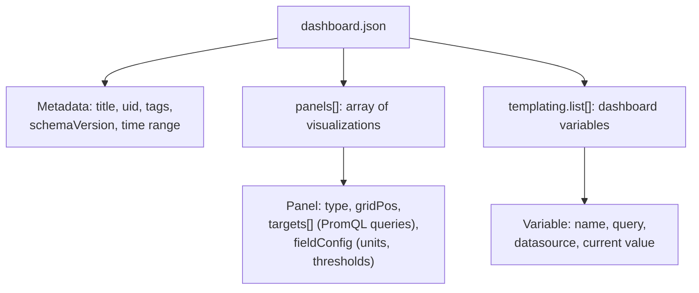

# Grafana Dashboards-as-Code (Reference)

> **Concept bible** — durable reference material on Grafana's provisioning model and dashboard JSON schema, illustrated with Jovavia's actual dashboards.

## Purpose

A Grafana dashboard is, underneath the drag-and-drop editor, a JSON document with a well-defined (if sprawling) schema. This document explains that schema well enough to read, debug, and hand-edit a dashboard JSON file directly — a skill that matters the moment provisioning behaves unexpectedly (see the PgBouncer dashboard's single-database-scope gap in [Grafana Runbook](../runbooks/grafana-runbook.md) Troubleshooting) or a change is easier to make as a text edit than a UI click-through.

## Architecture



**Provisioning vs. dashboard JSON are two different YAML/JSON layers, easy to conflate.** The *provider* config (`docker/grafana/provisioning/dashboards/dashboard.yml`) tells Grafana *where to look* for dashboard files and *how to organize* what it finds. The *dashboard* JSON files themselves (`docker/grafana/dashboards/**/*.json`) are the actual visualizations. Changing one never changes the other — a common point of confusion when debugging "why did my dashboard change/not change."

## Configuration

**Provider config** — governs discovery and organization, not content:

```yaml
# docker/grafana/provisioning/dashboards/dashboard.yml
apiVersion: 1
providers:
  - name: "Jovavia Infrastructure"
    type: file
    options:
      path: /var/lib/grafana/dashboards
      foldersFromFilesStructure: true
```

There is no static `folder:` value in this provider config — with `foldersFromFilesStructure: true`, folder placement comes entirely from where each dashboard file lives under `options.path` (`docker/grafana/dashboards/postgres/`, `docker/grafana/dashboards/pgbouncer/`, and so on), so a `folder:` field would be dead configuration if it were present. See [Grafana Runbook](../runbooks/grafana-runbook.md) for the resulting folder tree.

**Dashboard JSON** — the actual content. A minimal but complete anatomy, using the shape of Jovavia's custom PgBouncer dashboard as the example:

```json
{
  "title": "Jovavia - PgBouncer Overview",
  "uid": "jovavia-pgbouncer",
  "tags": ["jovavia", "pgbouncer"],
  "refresh": "10s",
  "time": { "from": "now-30m", "to": "now" },
  "panels": [
    {
      "id": 1,
      "type": "stat",
      "title": "Active Clients",
      "gridPos": { "h": 5, "w": 6, "x": 0, "y": 0 },
      "datasource": { "type": "prometheus", "uid": "prometheus" },
      "targets": [
        { "expr": "sum(pgbouncer_pools_client_active_connections{database=\"jovavia_identity\"})", "refId": "A" }
      ],
      "fieldConfig": {
        "defaults": {
          "color": { "mode": "thresholds" },
          "thresholds": { "mode": "absolute", "steps": [
            { "color": "green", "value": 0 },
            { "color": "red", "value": 20 }
          ]}
        }
      }
    }
  ],
  "templating": { "list": [] }
}
```

Every field earns its place: `uid` is the stable identifier used in URLs and API calls (changing it breaks bookmarks/links — `title` can change freely, `uid` should not); `gridPos` is a 24-column grid layout system (`x`/`w` in grid units, `h`/`y` in row units); `datasource.uid: "prometheus"` must match the `uid` declared in the datasource provisioning file exactly, or the panel fails to resolve its data source; `refId` distinguishes multiple queries within one panel (needed when a panel overlays several PromQL expressions, as several of Jovavia's timeseries panels do).

## Operational Notes

**Template variables** (`templating.list[]`) turn a static dashboard into a parameterized one — a variable's `query` is itself evaluated against the datasource (often via Prometheus's `label_values()` or `query_result()` functions), and its resolved value(s) substitute into every panel query referencing `$variablename`. A chain of dependent variables is only as reliable as its first link: a variable whose query depends on a label that doesn't exist in this deployment (a `kubernetes_namespace` or `release` label from a Helm-chart-injected exporter, for instance) resolves to nothing, which empties every downstream variable and every panel filtered by it. This is why `jovavia-postgres-overview.json`'s `instance` variable is built directly on `label_values(pg_up, instance)` rather than chaining through Kubernetes-only labels — see [Grafana Runbook](../runbooks/grafana-runbook.md) for the dashboard's history.

**`foldersFromFilesStructure`** changes what "the file's location" means for organizational purposes — with it `true` (Jovavia's setting), a dashboard's folder is derived from its path under the provider's `options.path`, and the provider-level static `folder` setting is ignored. This is fully documented as a decision in [ADR-0032: Grafana Provisioning (File-Based, Not UI/API)](../adr/ADR-0032-grafana-provisioning.md).

## Troubleshooting

**A panel shows "Datasource not found."** The panel's `datasource.uid` doesn't match any provisioned datasource's `uid` — check `provisioning/datasources/*.yml` for the actual configured `uid` (Jovavia's is literally `prometheus`, set explicitly rather than left to Grafana's auto-generated default) and confirm every panel's `datasource` block references it with the explicit-uid form both shipped dashboards use.

**A template variable dropdown is empty.** Its `query` returned no results — run the same query manually against Prometheus's UI (`/graph`) to see why; almost always a label that doesn't exist in this deployment's actual metric set (a Kubernetes/Helm-only label is the classic case — see [Grafana Runbook](../runbooks/grafana-runbook.md)).

**Editing a dashboard JSON file directly doesn't seem to update Grafana.** Confirm the container actually restarted or Grafana's provisioning polling picked up the change — file-based provisioning reconciles on container start; live-reload behavior depends on Grafana version/configuration and shouldn't be assumed without checking `docker compose logs grafana` for a provisioning-reload message.

## Production Considerations

- Hand-editing dashboard JSON is completely reasonable for small, deliberate changes (a threshold value, a query filter) but becomes error-prone for structural changes (new panels, layout changes) — use Grafana's UI editor for structural work, then export the resulting JSON back into the file (Dashboard settings → JSON Model → copy) rather than hand-writing complex panel definitions from scratch.
- `schemaVersion` (present in both Jovavia dashboards) indicates which Grafana dashboard schema the JSON targets — a significant Grafana version upgrade can require schema migration; Grafana handles minor schema differences automatically on load, but this is worth checking whenever the pinned Grafana image version (currently `12.2.0`) is bumped.
- Dashboard `uid` collisions across files would cause one to silently fail to provision or overwrite the other — keep `uid`s explicit and unique, as Jovavia's custom dashboard already does (`jovavia-pgbouncer`).

## Future Improvements

- Consider Grafonnet (Jsonnet library for Grafana dashboards) or `grizzly` once dashboard count and complexity grow enough that hand-maintained JSON becomes error-prone — neither is justified at two dashboards today.
- Add a lightweight CI check that runs `python3 -m json.tool` (or equivalent) against every dashboard JSON file to catch syntax errors before they reach a provisioned environment.
