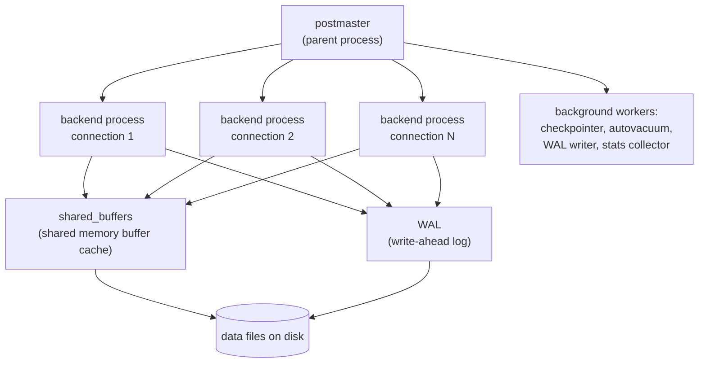

# PostgreSQL Internals (Reference)

> **Concept bible** — durable reference material, not Sprint-specific. Written to still be correct and useful long after Sprint 0's specific configuration has evolved. Where this document ties back to Jovavia's actual `postgresql.conf`, that's a worked example of the underlying concept, not the point of the document.

## Purpose

Every operational decision in [PostgreSQL Runbook](../runbooks/postgres-runbook.md) and every tuning value in `postgresql.conf` rests on a small set of internal mechanisms: MVCC, the WAL, the buffer cache, and the process model. This document is the reference to come back to whenever "why does Postgres behave this way" comes up — so that answer doesn't have to be re-derived from scratch, or worse, guessed.

## Architecture

**Process model.** PostgreSQL is process-based, not thread-based: the postmaster (the parent process) forks one backend OS process per connection. This is why connection count is a real, first-class resource cost (see `max_connections`) and why connection pooling (PgBouncer, [Connection Pooling & PgBouncer (Reference)](connection-pooling-and-pgbouncer.md)) matters as much as it does — every connection is a process, not a lightweight thread.



**MVCC (Multi-Version Concurrency Control).** PostgreSQL never updates a row in place — an `UPDATE` creates a new row version and marks the old one as no-longer-visible-to-new-transactions (rather than deleting it immediately); a `DELETE` similarly just marks a row invisible rather than removing it. This is what lets readers never block writers and writers never block readers under normal isolation levels — each transaction sees a consistent snapshot of the data as of when it started, regardless of concurrent writes happening around it. The cost: dead row versions accumulate and must be reclaimed — that's `VACUUM`'s job, running automatically via autovacuum in the background.

**WAL (Write-Ahead Log).** Every change is written to the WAL *before* it's considered durable — the actual data file pages can lag behind and be written out lazily by the background writer/checkpointer, because on crash recovery, Postgres replays the WAL forward from the last checkpoint to reconstruct any changes that were durably logged but not yet reflected in the data files. This is the mechanism `wal_level = replica` (Jovavia's `postgresql.conf`) builds on: at this level, the WAL contains enough information not just for crash recovery but for a *separate* replica to apply it too — which is what makes streaming replication and PITR (point-in-time recovery) possible without any additional configuration beyond enabling replication slots and standbys.

**Shared buffers and the OS page cache.** `shared_buffers` (Jovavia: `512MB`) is Postgres's own in-memory cache of data pages, shared across all backend processes. `effective_cache_size` (Jovavia: `2GB`) is not an allocation at all — it's a hint to the query planner about how much memory is *likely* available across `shared_buffers` and the OS's own page cache combined, used purely to estimate whether an index scan's random I/O will likely be served from cache versus disk. Setting it wrong doesn't waste memory (it allocates nothing); it just biases the planner toward or away from index scans incorrectly.

## Configuration

Jovavia's `postgresql.conf`, annotated:

```ini
shared_buffers = 512MB          # actual shared cache — real memory allocation
effective_cache_size = 2GB      # planner hint only, not an allocation
work_mem = 8MB                  # PER SORT/HASH OPERATION, per connection — see below
maintenance_work_mem = 128MB    # for VACUUM, CREATE INDEX, etc. — can be higher than work_mem safely
max_connections = 300           # hard ceiling on backend processes
wal_level = replica              # enables replication-capable WAL (not currently used, but ready)
max_wal_senders = 10             # max concurrent replication connections
checkpoint_completion_target = 0.9   # spread checkpoint I/O over 90% of the checkpoint interval
checkpoint_timeout = 10min
shared_preload_libraries = 'pg_stat_statements'   # query-level stats, loaded at server start (can't be added without restart)
random_page_cost = 1.1           # tuned for SSD — default 4.0 assumes spinning disks
```

**`work_mem` is the setting most likely to surprise someone tuning this later**: `8MB` is *per sort or hash operation, per connection*, not a global pool. A single complex query with several sorts/hash joins can use a multiple of `work_mem` simultaneously, and that multiplies again across concurrent connections. This is precisely why connection pooling (bounding concurrent backend count via PgBouncer) interacts directly with memory safety, not just connection-count limits — fewer, better-utilized backend connections means `work_mem` multiplied by a smaller, more predictable number.

## Operational Notes

**Autovacuum** runs continuously in the background, is on by default, and is not separately configured in Jovavia's `postgresql.conf` — meaning it's running with PostgreSQL 17's stock defaults. This is fine at Sprint 0's near-zero data volume; autovacuum tuning (`autovacuum_vacuum_scale_factor`, worker count) becomes a real operational concern once tables have meaningful write/update volume, because default autovacuum settings scale poorly on very large or very high-churn tables.

**`pg_stat_statements`** (enabled via `shared_preload_libraries`) tracks per-query-shape execution statistics (calls, total time, rows) in memory, queryable via the `pg_stat_statements` view. This is the foundation for any query-level performance work and is what `postgres_exporter`'s custom-queries feature could expose to Prometheus (see [ADR-0031: Metrics Exporters (postgres_exporter, pgbouncer_exporter)](../adr/ADR-0031-metrics-exporters.md) Future Improvements) — currently collected but not yet surfaced outside direct SQL access.

## Troubleshooting

**Query performance degrades over time without an obvious cause.** Check `pg_stat_user_tables` for `n_dead_tup` (dead row count) relative to `n_live_tup` — a high ratio indicates autovacuum isn't keeping up, often because of a long-running transaction holding back the "oldest needed" snapshot MVCC must preserve, preventing dead rows from being reclaimed even though autovacuum is running.

**"Connection slots reserved" or `max_connections` exhaustion despite PgBouncer being in place.** Verify no application path is bypassing PgBouncer and connecting to `:5432` directly (see [PostgreSQL Runbook](../runbooks/postgres-runbook.md)) — this is by far the most common cause once pooling is supposedly in place.

**A query that should use an index does a sequential scan instead.** Check `effective_cache_size` and `random_page_cost` are set sensibly for the actual storage medium (Jovavia's `random_page_cost = 1.1` assumes SSD-backed storage; the Postgres default of `4.0` assumes spinning disks and will bias the planner away from index scans more aggressively than modern storage justifies) — then check `EXPLAIN ANALYZE` for actual row-count estimates versus reality, since planner misestimates (usually from stale statistics — `ANALYZE` the table) are a more common cause than a genuinely wrong cost setting.

## Production Considerations

- `shared_buffers`/`effective_cache_size` are explicitly tuned for local development ("good defaults for local MacBook" per the config file's own comment) — real production tuning requires knowing actual host memory and should follow the general 25%/50-75% starting ratios, refined from observed behavior, not applied blindly.
- `wal_level = replica` costs a small, constant amount of additional WAL volume compared to `wal_level = minimal`, in exchange for replication readiness — a reasonable trade to make upfront (avoiding a disruptive `wal_level` change plus restart later) rather than to defer.
- No connection-level statement timeout (`statement_timeout`) is set — a runaway query can hold a connection (and its `work_mem` allocations) indefinitely. Worth setting a sane default (e.g., 30s–60s) at the role or database level before production traffic.

## Future Improvements

- Set `statement_timeout` and `idle_in_transaction_session_timeout` at the role level to bound worst-case resource holding.
- Tune autovacuum settings once real write/update volume exists, rather than relying on PostgreSQL 17 stock defaults.
- Expose `pg_stat_statements` data through `postgres_exporter`'s custom query support for query-level Prometheus metrics.
- Stand up an actual streaming replica now that `wal_level`/`max_wal_senders`/`hot_standby` are already configured for it — the configuration cost was paid upfront specifically so this is additive, not disruptive, work later.
