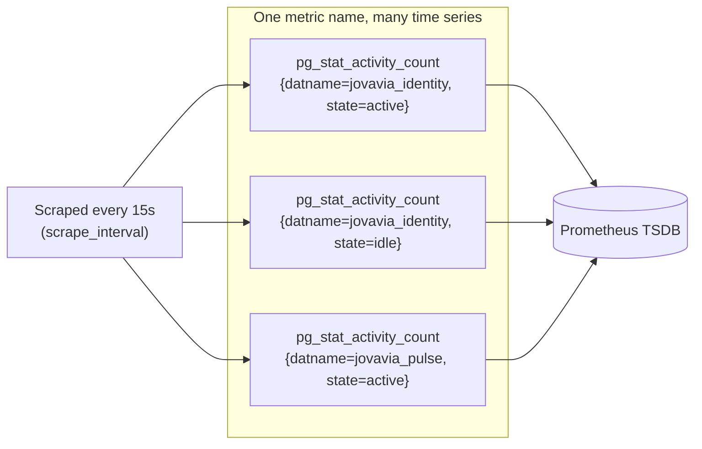

# Prometheus & PromQL (Reference)

> **Concept bible** — durable reference material covering Prometheus's data model and PromQL mechanics generally, illustrated with Jovavia's actual metrics where useful.

## Purpose

Every alert rule in [ADR-0033: Prometheus Alerting Rules](../adr/ADR-0033-prometheus-alerting.md) and every panel in the Grafana dashboards ([Grafana Dashboards-as-Code (Reference)](grafana-dashboards-as-code.md)) is a PromQL expression evaluated against Prometheus's time series data. This document explains the data model and query language well enough to write a new alert or dashboard panel confidently, not just copy an existing one and hope.

## Architecture

**The data model: everything is a time series identified by labels.** A Prometheus metric is not a single number — it's a metric name plus a set of key-value labels, and every unique combination of name+labels is its own independent time series. `pg_stat_activity_count{datname="jovavia_identity", state="active"}` and `pg_stat_activity_count{datname="jovavia_pulse", state="active"}` are two entirely separate time series that happen to share a metric name.



**Pull, not push.** Prometheus scrapes each target's `/metrics` HTTP endpoint on its own schedule (`scrape_interval: 15s` in Jovavia's config) — targets don't push data to Prometheus. This is why a target being unreachable shows up as `up == 0` (a metric Prometheus itself synthesizes per target) rather than simply absent data, and why `static_configs` (or service discovery) exists: Prometheus needs to know *where to pull from*.

**Four metric types**, though PromQL treats most of the meaningful complexity as living in two of them:

| Type | Behavior | Example in this stack |
|---|---|---|
| Counter | Monotonically increasing, resets to 0 only on restart | `pgbouncer_stats_totals_queries_pooled_total` |
| Gauge | Goes up and down freely | `pg_stat_activity_count`, `pgbouncer_pools_client_waiting_connections` |
| Histogram | Bucketed observation counts (e.g., request duration buckets) | Not currently used by either exporter in this stack |
| Summary | Similar to histogram, pre-calculated quantiles | Not currently used by either exporter in this stack |

**Why `rate()` exists and when it's required.** A counter's raw value is nearly meaningless on its own (it's just "how many since the process started") — `rate(pgbouncer_stats_totals_queries_pooled_total[1m])` converts the counter into a per-second average rate of change over the trailing 1-minute window, which is what's actually useful ("how many queries per second right now"), and correctly handles counter resets (a process restart) without producing a nonsensical negative spike. **Gauges are never wrapped in `rate()`** — `pg_stat_activity_count > 80` (Jovavia's alert expression) compares the gauge's current value directly, because "80 connections" is already a meaningful absolute number, not a rate.

## Configuration

Jovavia's actual scrape and alerting configuration, annotated:

```yaml
global:
  scrape_interval: 15s        # how often Prometheus pulls /metrics from every target
  evaluation_interval: 15s    # how often alert rule expressions are re-evaluated
rule_files:
  - /etc/prometheus/alert.rules.yml
scrape_configs:
  - job_name: postgres
    static_configs:
      - targets: [postgres-exporter:9187]
```

`job_name` becomes the `job` label automatically attached to every metric scraped from that target — this is why `pg_up{job="postgres"}` and `pgbouncer_up{job="pgbouncer"}` are distinguishable even though both metrics conceptually mean "is this thing up."

Alert rule anatomy:

```yaml
- alert: PostgreSQLTooManyConnections
  expr: pg_stat_activity_count > 80
  for: 2m
  labels: { severity: warning }
  annotations: { summary: "PostgreSQL connections above threshold" }
```

`expr` is evaluated at every `evaluation_interval` tick. The moment it's true, the alert enters `pending` state. It only transitions to `firing` if the expression remains true continuously for the full `for:` duration — this is Prometheus's built-in flap-suppression mechanism, and it's why a single noisy scrape doesn't page anyone.

## Operational Notes

**PromQL query types worth knowing cold:**

```promql
# Instant vector — current value(s)
pg_up

# Range vector — a window of values, only useful inside a function like rate()
pg_stat_activity_count[5m]

# Rate of a counter over a window
rate(pgbouncer_stats_totals_queries_pooled_total[1m])

# Aggregation across label dimensions
sum by (database) (pgbouncer_pools_client_active_connections)

# Arithmetic between two vectors — used for percentage calculations
100 * sum(pgbouncer_pools_server_active_connections) / sum(pgbouncer_databases_pool_size)
```

That last pattern — computed percentage via arithmetic between two raw gauges — is exactly what the custom PgBouncer dashboard's "Pool Utilization" panel does live on every dashboard refresh (see [Grafana Dashboards-as-Code (Reference)](grafana-dashboards-as-code.md)); it is not a stored metric, it's computed at query time.

## Troubleshooting

**A PromQL expression returns nothing.** Almost always a label mismatch, not "no data exists" — query the base metric with no filters first (`pg_stat_activity_count`) to see what labels actually exist on it, then add filters incrementally. This is exactly the failure mode behind the broken PostgreSQL dashboard documented in [Observability](../architecture/observability.md): its queries filter on a `release` label that simply doesn't exist in this deployment's label set.

**A rate-based query looks wrong right after a target restart.** Expected — `rate()` handles counter resets by detecting a decrease and treating it as a reset, but the rate calculation across the reset boundary can look artificially low or spike for one evaluation window. This self-corrects within one or two scrape intervals.

**An alert fires immediately on a transient blip you expected `for:` to suppress.** Confirm the condition is genuinely transient and not actually sustained — `for:` suppresses noise but doesn't second-guess a condition that really did hold for its full duration; check the raw metric's graph over the relevant window before assuming the `for:` mechanism itself is broken.

## Production Considerations

- Cardinality (the number of unique label combinations for a metric) directly drives Prometheus's memory and storage cost — both exporters in this stack have naturally bounded cardinality (fixed database/pool names), which is a large part of why this deployment is cheap to run; adding high-cardinality labels (user IDs, request IDs, unbounded free-text values) to any future custom metric is the most common way to accidentally make a Prometheus deployment expensive or unstable.
- `evaluation_interval` and `scrape_interval` being equal (both 15s) is a reasonable default; setting `evaluation_interval` shorter than `scrape_interval` provides no benefit (alert rules can't see data more frequently than it's actually scraped) and is a common, harmless-but-pointless misconfiguration to watch for.

## Future Improvements

- Add recording rules for the PgBouncer pool-utilization-percentage pattern shown above — precomputing it once per evaluation cycle rather than recalculating it on every dashboard panel refresh, reducing query load as dashboard viewership grows.
- Adopt histogram-based metrics once any component in this stack needs latency-distribution visibility (e.g., a future Jovavia service's HTTP request duration) — neither current exporter needs this today, but it's the natural next metric type this stack will need.
- Consider Alertmanager's `for:` interaction with notification grouping/inhibition once Alertmanager exists (see [ADR-0033: Prometheus Alerting Rules](../adr/ADR-0033-prometheus-alerting.md)) — `for:` controls when an alert starts firing; Alertmanager's own grouping/silencing controls what happens to it after.
