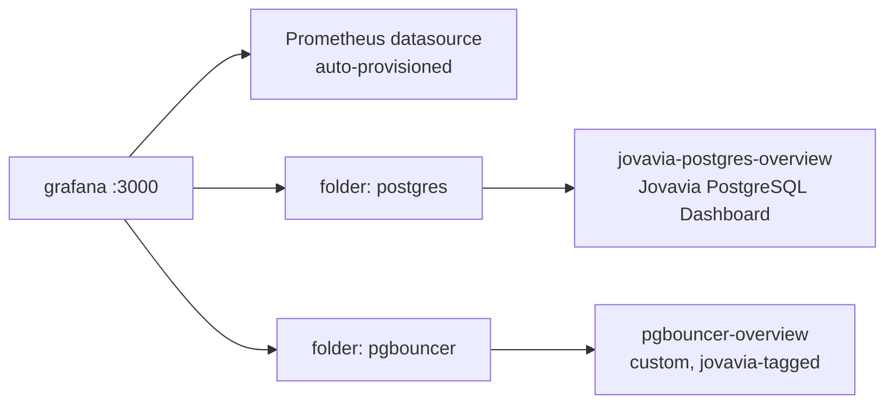

# Grafana Runbook

## Purpose

Operational reference for Grafana: accessing it, verifying provisioning succeeded, and — a support ticket this component has generated historically — diagnosing why the PostgreSQL dashboard shows empty panels (see the Dashboard Compatibility Note below for why that's now unlikely with the current dashboard).

## Architecture

See [ADR-0032: Grafana Provisioning (File-Based, Not UI/API)](../adr/ADR-0032-grafana-provisioning.md) for the full provisioning design and the `foldersFromFilesStructure` behavior. This document assumes that context and focuses on day-to-day operation.



Folders are derived from where each dashboard file lives on disk (`foldersFromFilesStructure: true` — see [ADR-0032](../adr/ADR-0032-grafana-provisioning.md)), so the folder tree grows as new component dashboards are added:

```text
Dashboards/
├── postgres/    (jovavia-postgres-overview.json — shipped)
├── pgbouncer/   (pgbouncer-overview.json — shipped)
├── redis/       (planned — Sprint 1, see Future Improvements)
├── kafka/       (planned — Sprint 2)
└── platform/    (planned)
```

Only `postgres/` and `pgbouncer/` exist today; `redis/`, `kafka/`, and `platform/` are the intended structure once those components ship, not something currently provisioned.

## Configuration

Login: `GRAFANA_ADMIN_USER` / `GRAFANA_ADMIN_PASSWORD` from `.env` (defaults `admin`/`admin` in `.env.example` — see Production Considerations). URL: `http://localhost:${GRAFANA_PORT}` (default `3000`).

```bash
# Confirm Grafana is serving
curl -s http://localhost:3000/api/health

# List provisioned datasources via API (requires auth)
curl -s -u admin:admin http://localhost:3000/api/datasources

# List dashboards by folder
curl -s -u admin:admin http://localhost:3000/api/search
```

## Operational Notes

Both dashboards are provisioned automatically on every container start — there is no manual dashboard import step required for a fresh environment. `docker compose up -d grafana` (or the full stack) is sufficient; the Prometheus datasource and both dashboards should be present within seconds of the container reporting healthy.

Dashboards land in folders named **"postgres"** and **"pgbouncer"**, derived from each dashboard file's path under `docker/grafana/dashboards/` — this is `foldersFromFilesStructure: true`, fully explained in [ADR-0032: Grafana Provisioning (File-Based, Not UI/API)](../adr/ADR-0032-grafana-provisioning.md). `dashboard.yml`'s provider config no longer sets a static `folder:` value; the filesystem structure is the only thing that determines dashboard placement.

> **Dashboard Compatibility Note.** Grafana's community PostgreSQL dashboard (Grafana.com ID `9628`) was evaluated for the "postgres" folder's dashboard and not adopted: its template variables depend on `release` and `kubernetes_namespace` labels that only exist when `postgres_exporter` is deployed via its Kubernetes Helm chart — labels this Docker Compose deployment never produces. Jovavia replaced it with `jovavia-postgres-overview.json`, built directly against plain `static_configs`-based metric labels and verified compatible with `prometheuscommunity/postgres-exporter:v0.17.1` (the pinned exporter version) running under Docker Compose.

## Troubleshooting

**The PostgreSQL dashboard ("jovavia-postgres-overview", folder "postgres") shows "No data" on almost every panel.** This was a confirmed, reproducible issue with the community dashboard evaluated and rejected for this role — see the Dashboard Compatibility Note above. `jovavia-postgres-overview.json` is built against `label_values(pg_up, instance)` directly, which resolves correctly against this stack's plain Docker Compose labels and doesn't carry that dependency. If you see "No data" today, check `docker compose logs postgres-exporter` and confirm `pg_up` returns data in Prometheus's own UI before suspecting the dashboard.

**The PgBouncer dashboard's top-row stat panels look wrong or static.** Check the panel's query — the four stat panels ("Active Clients," "Waiting Clients," etc.) are hardcoded to `database="jovavia_identity"` specifically, not aggregated across all five Jovavia databases. This is a real scope limitation in the current dashboard: the timeseries panels below them (`sum by (database)(...)`) correctly cover all databases, but the headline stat panels only reflect one. Worth fixing if pool pressure on `jovavia_pulse`/`jovavia_guardian`/`jovavia_vault`/`jovavia_event_mesh` specifically needs to be visible at a glance.

**A dashboard fails to load / provisioning error in logs.** `docker compose logs grafana` — malformed JSON in either dashboard file is the most likely cause; validate with `python3 -m json.tool docker/grafana/dashboards/<path>/<file>.json` before committing a change.

**Can't log in / forgot the admin password.** It's whatever `GRAFANA_ADMIN_PASSWORD` was set to in `.env` at the time the container's data volume was first initialized — Grafana only applies `GF_SECURITY_ADMIN_PASSWORD` on first startup with an empty database, not on every restart. Changing `.env` after the fact does **not** change an already-provisioned admin password; use Grafana's own password reset flow or reset the data volume in local development.

## Production Considerations

- **`admin`/`admin` default credentials, if never rotated, are a real and common real-world breach vector** — Grafana instances with default credentials are a known, actively-scanned-for target on the open internet. This must be rotated before Grafana is reachable from anywhere beyond a trusted local network, and the rotation must happen through a proper secrets flow, not a `.env` file (see [Environment Variables](../setup/environment-variables.md)).
- The PgBouncer dashboard has a known, documented gap (single-database scope on its stat panels, see Troubleshooting above) — treat it as a working starting point, not a finished operational surface, before relying on it during an actual incident.
- No Grafana-level alerting (distinct from Prometheus's alert rules) is configured, and no Grafana Alerting contact points exist — if the team ever prefers Grafana-native alerting over Alertmanager, that's a separate, currently-empty configuration surface.

## Future Improvements

- Extend `pgbouncer-overview.json`'s stat panels to aggregate across all five databases, or add a dashboard-level database-selector template variable so any one database can be focused on without editing the dashboard.
- Rotate `GRAFANA_ADMIN_PASSWORD` out of `.env` and into a real secrets flow.
- Consider Grafana Alerting or confirm Alertmanager (once deployed, per [ADR-0033: Prometheus Alerting Rules](../adr/ADR-0033-prometheus-alerting.md)) is the single source of truth for alert routing, to avoid two parallel, inconsistent alerting configurations.
- Add a "Jovavia Overview" top-level dashboard once a third or fourth component exists, giving a single-pane-of-glass view rather than requiring a jump between per-component dashboards.
