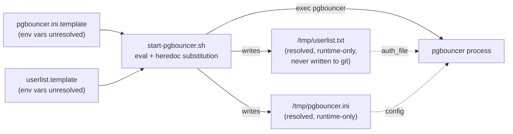

# PgBouncer Runbook

## Purpose

Operational reference for the PgBouncer connection pooler: pool diagnostics, config regeneration mechanics, and how PgBouncer's client-facing credentials are generated at container startup rather than committed to source control.

## Architecture



Neither PgBouncer's config nor its client credential file is a static, committed artifact — both are generated fresh on every container start by `start-pgbouncer.sh`, substituting environment variables into `pgbouncer.ini.template` and `userlist.template` before the actual `pgbouncer` process ever starts. `userlist.template` contains no real secret; the actual password only ever exists at runtime, in `/tmp/userlist.txt`, inside the running container.

## Configuration

```sh
#!/bin/sh
# docker/pgbouncer/start-pgbouncer.sh
set -eu
echo "Generating PgBouncer configuration..."
eval "cat <<EOF
$(cat /etc/pgbouncer/pgbouncer.ini.template)
EOF" > /tmp/pgbouncer.ini

echo "Generating PgBouncer userlist..."
eval "cat <<EOF
$(cat /etc/pgbouncer/userlist.template)
EOF" > /tmp/userlist.txt

echo "===== PgBouncer Config ====="
cat /tmp/pgbouncer.ini
echo "============================"
exec pgbouncer /tmp/pgbouncer.ini
```

```ini
;; docker/pgbouncer/conf/pgbouncer.ini.template (excerpt)
[databases]
* = host=${POSTGRES_HOST} port=${POSTGRES_PORT} auth_user=${POSTGRES_USER}
[pgbouncer]
pool_mode = ${PGBOUNCER_POOL_MODE}
auth_type = scram-sha-256
auth_file = /tmp/userlist.txt
```

```ini
;; docker/pgbouncer/conf/userlist.template (committed to git — no real credential in this file)
"${POSTGRES_USER}" "${POSTGRES_PASSWORD}"
```

`userlist.template` is the only credential-adjacent file committed to source control, and it contains no actual password — just the same `${POSTGRES_USER}`/`${POSTGRES_PASSWORD}` placeholders already used elsewhere in `.env`. The resolved `/tmp/userlist.txt`, with the real password substituted in, only ever exists inside the running container's filesystem and is never written back to the repository.

## Operational Notes

**Config and credential regeneration mechanism.** `eval "cat <<EOF ... EOF"` is a shell heredoc trick that forces variable expansion of every `${VAR}` in a template against the container's current environment. `start-pgbouncer.sh` runs this twice — once for `pgbouncer.ini.template` → `/tmp/pgbouncer.ini`, once for `userlist.template` → `/tmp/userlist.txt` — before `exec pgbouncer` replaces the shell process entirely. This means **every container restart re-reads current environment variables for both config and credentials** — changing `PGBOUNCER_DEFAULT_POOL_SIZE` or `POSTGRES_PASSWORD` in `.env` and restarting the container is sufficient to apply it; no manual file editing needed, and no credential file to keep in sync by hand.

**Common commands:**

```bash
# View the actual resolved config (also printed to container logs on start)
docker compose logs pgbouncer | sed -n '/Generated PgBouncer Config/,/====/p'

# Connect to PgBouncer's admin console
docker compose exec pgbouncer psql -h localhost -p ${PGBOUNCER_PORT} -U jovavia pgbouncer

# Inside the admin console:
SHOW POOLS;
SHOW STATS;
SHOW CLIENTS;
SHOW SERVERS;
```

`SHOW POOLS` is the single most useful diagnostic command — it shows `cl_active`, `cl_waiting`, `sv_active`, `sv_idle` per database/user pair, the same data the custom Grafana dashboard visualizes (see [Observability](../architecture/observability.md)).

## Troubleshooting

**Clients get `query_wait_timeout` errors.** `SHOW POOLS` will show `cl_waiting > 0` sustained — the pool for that database/user is saturated. Either query duration is the problem (check Postgres's own slow-query log, [PostgreSQL Runbook](postgres-runbook.md)) or `default_pool_size` is genuinely undersized for current load.

**New `pgbouncer.ini.template` or `userlist.template` changes aren't taking effect.** Confirm the container actually restarted (`docker compose up -d --force-recreate pgbouncer` if in doubt) — both templates are only re-rendered at container start, not watched for live changes.

**Authentication failures (`password authentication failed`) after changing `POSTGRES_PASSWORD`.** Since `userlist.template` is rendered from the same `POSTGRES_PASSWORD` variable on every container start, a plain restart (or `docker compose up -d --force-recreate pgbouncer`) is normally sufficient to pick up a changed password — check that the container actually restarted before assuming a deeper problem. If authentication still fails after a confirmed restart, exec into the container and inspect `/tmp/userlist.txt` directly to confirm the substitution resolved to the value you expect (this also catches the shell-injection edge case below).

**`eval`-based templating fails or behaves unexpectedly with special characters in a variable.** Because `eval "cat <<EOF ... EOF"` interpolates a template through a shell heredoc, any environment variable value containing shell-meaningful characters (backticks, `$(...)`, unescaped quotes) will be interpreted, not treated as a literal string — this applies equally to `POSTGRES_PASSWORD` when it's substituted into `userlist.template`. A password containing `$(whoami)` (unlikely, but not impossible from an automated secrets generator) would execute rather than substitute literally. Keep generated credentials to alphanumeric-plus-safe-punctuation until this templating mechanism is replaced (see Future Improvements).

## Production Considerations

- **No PgBouncer credential file is committed to source control.** `userlist.template` holds only the `${POSTGRES_USER}`/`${POSTGRES_PASSWORD}` placeholders; the resolved `/tmp/userlist.txt` is generated at container startup and exists only inside the running container, never written back to the repository or any persisted volume outside it. This closes the previous gap where a real password could end up in git history.
- **`userlist.txt` and `.env`'s `POSTGRES_PASSWORD` now share one source of truth.** Because both `pgbouncer.ini.template`'s `auth_user` and `userlist.template`'s password are resolved from the same `.env` at every container start, a password rotation that updates `.env` and restarts the container keeps PgBouncer→Postgres and client→PgBouncer authentication in sync automatically — no manual dual-update step remains.
- **The `eval`-based template substitution mechanism is fragile by construction** — functionally correct for the current templates, but the wrong tool the moment templates or values grow more complex, and it now runs twice per startup (once for `pgbouncer.ini.template`, once for `userlist.template`). `envsubst` (POSIX-standard, no arbitrary code execution risk) or a proper templating tool (`gomplate`, `confd`) both eliminate the shell-injection surface area entirely.
- PgBouncer's admin console credentials are the same as the application's (`admin_users = ${POSTGRES_USER}`) — no separate, more restricted admin identity exists for pure observability/debugging access.

## Future Improvements

- **Switch to `auth_query`**: configure PgBouncer to authenticate against Postgres's own `pg_shadow`/`pg_authid` via a query, eliminating `userlist.template`/`userlist.txt` as a separate credential file entirely. This is the standard production pattern and removes the templating mechanism as a factor in credential handling altogether.
- **Replace `eval`+heredoc templating with `envsubst`** for both `pgbouncer.ini.template` and `userlist.template` — same substitution semantics, no shell-injection surface, a small, mechanical change in `start-pgbouncer.sh`.
- **Source `POSTGRES_PASSWORD` from a real secrets manager rather than `.env`**, as part of the broader secrets-management improvement tracked in [Environment Variables](../setup/environment-variables.md) — the templating flow itself no longer needs to change for this, only where the underlying environment variable's value comes from.
- On Kubernetes migration, this entire config-and-credential-generation pattern becomes an init container reading from a Secret/ConfigMap — a natural fit, but only after the `eval` risk is addressed, since Kubernetes Secrets are exactly the kind of dynamically-injected value most likely to contain characters that would misbehave under the current shell-eval approach.
