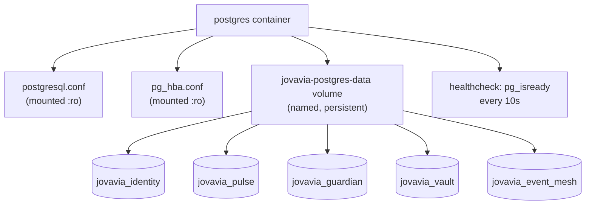

# PostgreSQL Runbook

## Purpose

The on-call reference for the PostgreSQL 17 instance backing all five Jovavia databases — how to check it, restart it, read its logs, and diagnose the failure modes its own configuration makes possible. This is an operational document, not an architecture explainer; see [Infrastructure Overview](../architecture/infrastructure-overview.md) and [PostgreSQL Internals (Reference)](../concepts/postgresql-internals.md) for the "why," this document is the "what do I do right now."

## Architecture

One container, one `postgres:17` process, five logical databases, config mounted read-only from `docker/postgres/conf/`:



## Configuration

Key `postgresql.conf` values (full file at `docker/postgres/conf/postgresql.conf`):

```ini
max_connections = 300
shared_buffers = 512MB
effective_cache_size = 2GB
work_mem = 8MB
maintenance_work_mem = 128MB
wal_level = replica
max_wal_senders = 10
max_replication_slots = 10
hot_standby = on
checkpoint_completion_target = 0.9
checkpoint_timeout = 10min
log_min_duration_statement = 200
shared_preload_libraries = 'pg_stat_statements'
```

`pg_hba.conf`:

```
local    all   all                       scram-sha-256
host     all   all   127.0.0.1/32        scram-sha-256
host     all   all   ::1/128             scram-sha-256
host     all   all   0.0.0.0/0           scram-sha-256
host     replication all 0.0.0.0/0       scram-sha-256
```

Both files are mounted read-only and passed explicitly on the command line (`postgres -c config_file=... -c hba_file=...`) rather than relying on the image's default paths — a deliberate choice so the entire runtime configuration is visible in version control, not partially hidden inside the base image.

## Operational Notes

**Health signal:** `healthcheck: pg_isready -U ${POSTGRES_USER} -d postgres` every 10s, 5 retries, 15s start period. `docker compose ps` is the fastest way to check current health; every downstream service (`pgbouncer`, indirectly everything else) gates its own startup on this specific healthcheck passing.

**Logging:** `log_min_duration_statement = 200` means any statement taking longer than 200ms is logged — this is your first stop for "why is X slow," via `docker compose logs postgres`, before reaching for `pg_stat_statements` or `EXPLAIN ANALYZE`. `log_statement = 'ddl'` means only schema changes are logged at the statement level (not every `SELECT`/`INSERT`), keeping log volume manageable while still capturing every `CREATE`/`ALTER`/`DROP` for audit purposes.

**Common commands:**

```bash
# Check health / uptime
docker compose exec postgres pg_isready -U jovavia -d postgres

# Connect interactively
docker compose exec postgres psql -U jovavia -d jovavia_identity

# Tail slow-query and DDL logs
docker compose logs -f postgres

# Check current connection count against max_connections
docker compose exec postgres psql -U jovavia -d postgres -c \
  "SELECT count(*), setting FROM pg_stat_activity, pg_settings WHERE name='max_connections' GROUP BY setting;"
```

## Troubleshooting

**Container restart-loops or exits immediately.** Almost always a config syntax error in the two mounted files — `docker compose logs postgres` will show a `FATAL: configuration file contains errors` message naming the exact line. Both files are plain text, mounted read-only; edit, save, `docker compose up -d postgres` again.

**"Too many connections" errors from application services.** Check `pg_stat_activity` grouped by `state` and `application_name` before assuming `max_connections` needs raising — this is far more often a symptom of PgBouncer misconfiguration or bypass (a service connecting directly to `:5432` instead of PgBouncer's `:6432`) than genuine capacity exhaustion. See [PgBouncer Runbook](pgbouncer-runbook.md) and [ADR-0027: PgBouncer Connection Pooling Architecture](../adr/ADR-0027-pgbouncer-architecture.md).

**Data appears to have vanished after `docker compose down`.** Check whether `-v` was passed — `docker compose down -v` removes named volumes, including `jovavia-postgres-data`. Without `-v`, data persists across `down`/`up` cycles. There is currently no backup mechanism beyond this volume — see Production Considerations.

**Bootstrap script reports a database already exists but you don't see it.** Confirm you're connecting to the right instance/port and that `.env`'s `POSTGRES_*` values match what the container was actually started with — a stale `.env` after a credential rotation is a common cause of "the database I expect isn't there" confusion. See [Bootstrap Database](../setup/bootstrap-database.md).

## Production Considerations

- **`pg_hba.conf` allows `scram-sha-256` authentication from `0.0.0.0/0`** — any host that can reach the container's port can attempt authentication (though not bypass it; `scram-sha-256` is a strong auth mechanism). This is safe specifically because Docker's default bridge network isn't reachable from outside the host. The moment this stack runs anywhere with a routable network interface, this line needs to narrow to specific trusted CIDR ranges (application subnet, bastion, etc.) — do not carry `0.0.0.0/0` forward unchanged.
- **No backup strategy exists today.** `jovavia-postgres-data` is a Docker named volume with no snapshot, `pg_dump` schedule, or WAL archiving configured, despite `wal_level = replica` making WAL-based backup/PITR straightforward to add. This is the single most consequential gap for any environment holding real data.
- **`shared_buffers = 512MB` / `effective_cache_size = 2GB`** are tuned for "good defaults for local MacBook" (per the config file's own comment) — these need re-tuning against actual host memory once this runs on real infrastructure; a common rule of thumb is `shared_buffers` at ~25% of available RAM and `effective_cache_size` at ~50–75%, but the right numbers depend on the actual instance size chosen.
- Credentials (`POSTGRES_PASSWORD`) flow through `.env` in plaintext — see [Environment Variables](../setup/environment-variables.md) Production Considerations.

## Future Improvements

- Add automated backups: `pg_dump` on a schedule at minimum, WAL archiving + PITR (point-in-time recovery) given `wal_level = replica` is already set specifically to make this possible later.
- Narrow `pg_hba.conf` from `0.0.0.0/0` to explicit trusted ranges before any non-local deployment.
- Re-tune memory settings (`shared_buffers`, `effective_cache_size`, `work_mem`) against real target instance sizing.
- Add a read replica once `wal_level = replica` / `max_wal_senders` / `hot_standby` (already configured, currently unused) have a concrete consumer — either for read scaling or as a warm standby for failover.
- On Kubernetes migration, evaluate a managed Postgres operator (CloudNativePG, Zalando's postgres-operator) rather than hand-rolling StatefulSet + config management — both handle backup, failover, and replica management as first-class concerns this runbook currently covers manually.
