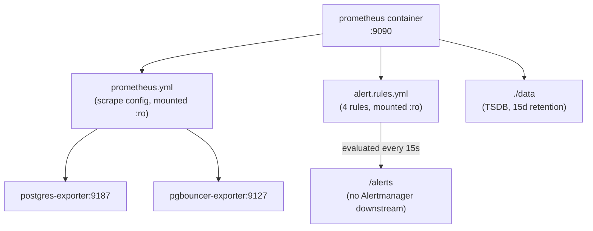

# Prometheus Runbook

## Purpose

Operational reference for the Prometheus instance: verifying scrape targets, validating alert rules, managing retention/storage, and the specific gap (no Alertmanager) every on-call engineer touching this stack needs to know about before relying on it.

## Architecture



## Configuration

```yaml
# docker/prometheus/docker-compose.yml (command)
command:
  - "--config.file=/etc/prometheus/prometheus.yml"
  - "--storage.tsdb.path=/prometheus"
  - "--storage.tsdb.retention.time=${PROMETHEUS_RETENTION}"   # 15d
```

Scrape config and alert rules are covered in full in [Observability](../architecture/observability.md) and [ADR-0033: Prometheus Alerting Rules](../adr/ADR-0033-prometheus-alerting.md) — this document is deliberately operational, not a repeat of that reasoning.

## Operational Notes

**Common commands / URLs:**

```bash
# Targets — confirm both exporters are UP
open http://localhost:9090/targets

# Rules — confirm all 4 alert rules loaded without error
open http://localhost:9090/rules

# Alerts — current firing/pending state
open http://localhost:9090/alerts

# Ad hoc PromQL query via API (useful for scripting/CI checks)
curl -s 'http://localhost:9090/api/v1/query?query=pg_up' | jq .

# Validate rule file syntax before deploying a change (run inside the container image's promtool)
docker compose exec prometheus promtool check rules /etc/prometheus/alert.rules.yml
docker compose exec prometheus promtool check config /etc/prometheus/prometheus.yml
```

`promtool check rules` and `check config` should be run locally (or in CI, see Future Improvements) before any change to `alert.rules.yml` or `prometheus.yml` — both fail fast on syntax errors that would otherwise only surface as "the rules silently didn't load" after a container restart.

## Troubleshooting

**A target shows `DOWN` on `/targets`.** Click through to see the specific scrape error — `context deadline exceeded` in the first 15–30 seconds after `docker compose up` is expected (see [Infrastructure Overview](../architecture/infrastructure-overview.md) Operational Notes); persisting beyond that means the exporter itself is unreachable or unhealthy — check `docker compose logs <exporter>` next, not Prometheus.

**`/rules` shows fewer than 4 rules, or a load error.** `alert.rules.yml` has a YAML syntax error — Prometheus fails to load the **entire file** on a syntax error, not just the malformed rule. Run `promtool check rules` locally to find the exact line before redeploying.

**An alert expression returns "no data" instead of evaluating to true/false.** This usually means the referenced metric name doesn't exist in scraped data at all — either the exporter version changed a metric name (check exporter release notes when bumping `prometheuscommunity/postgres-exporter` or `pgbouncer-exporter` versions), or the target is down entirely (see above). Query the raw metric directly (`pg_stat_activity_count`) in the Prometheus UI's graph view to confirm data exists before debugging the alert expression itself.

**Retention seems shorter than expected / old data is missing.** `PROMETHEUS_RETENTION=15d` is a hard cutoff — Prometheus deletes TSDB blocks older than this on a background compaction cycle, not instantly at exactly 15 days, so there's some natural slop. This is a Sprint 0-appropriate default, not a bug, but worth knowing before assuming a data-loss incident when older dashboard ranges come up empty.

**Disk usage growing unexpectedly.** Check cardinality — the number of unique label combinations, not raw metric count, drives TSDB size. Both exporters here have naturally bounded cardinality (fixed set of databases, fixed set of pool names), so unbounded growth would indicate either a misbehaving exporter or a scrape config change introducing high-cardinality labels (e.g., accidentally scraping per-query or per-connection-ID metrics).

## Production Considerations

- **No Alertmanager is deployed** — this is the load-bearing fact of this entire runbook and is documented in full in [ADR-0033: Prometheus Alerting Rules](../adr/ADR-0033-prometheus-alerting.md). Until that's fixed, "check `/alerts` manually" is a real, if unsatisfying, operational procedure that should be part of any on-call handoff for this environment.
- **15-day retention with no long-term storage backend** means any incident review or capacity-planning question older than 15 days has no data to answer it with. Fine for Sprint 0; a real gap the moment this environment has been running long enough to matter.
- **`static_configs` scrape targets are hardcoded hostnames** — adding a new exporter (a third Jovavia component, a future service's own `/metrics` endpoint) requires an explicit `prometheus.yml` edit and container restart, not automatic discovery. Low cost at 2 targets; will not scale gracefully to dozens.
- Prometheus itself has no `--web.enable-admin-api` exposure and no auth configured beyond what Docker network isolation provides — its query API and admin endpoints are wide open to anything on `jovavia-network`. Fine locally, not fine once this network boundary means anything.

## Future Improvements

- **Deploy Alertmanager** — the top priority; see [ADR-0033: Prometheus Alerting Rules](../adr/ADR-0033-prometheus-alerting.md) Future Improvements for the concrete plan.
- Move to `kubernetes_sd_configs` on Kubernetes migration, eliminating hardcoded `static_configs` targets entirely.
- Add `promtool check` to CI so a broken rule or config file is caught before merge, not at container-restart time.
- Extend retention or federate to long-term storage (Thanos, Mimir, or a managed equivalent) once historical trend analysis becomes a real need.
- Add basic auth or a reverse-proxy layer in front of Prometheus's UI/API before this is reachable from anywhere beyond a trusted local network.
