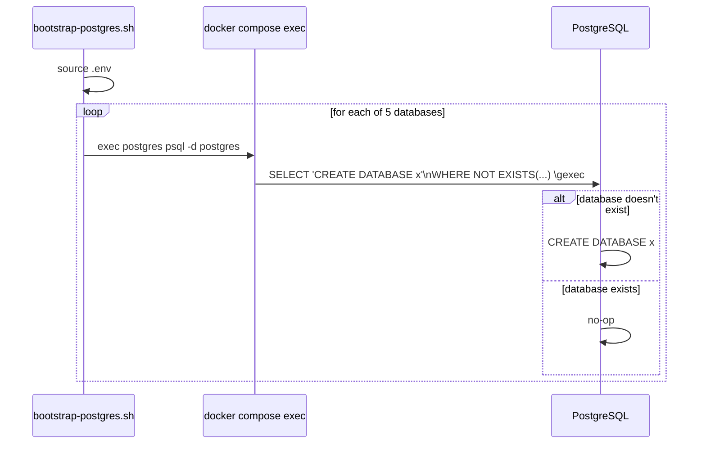

# Bootstrap Database

## Purpose

A line-by-line explanation of `scripts/bootstrap-postgres.sh` — what it does, why it's idempotent by construction, and why database creation lives in an application-layer script rather than `postgresql.conf`, `pg_hba.conf`, or the Postgres image itself.

## Architecture



## Configuration

```bash
#!/usr/bin/env bash
# scripts/bootstrap-postgres.sh
set -euo pipefail

set -a
source .env
set +a

echo "🚀 Bootstrapping Jovavia PostgreSQL..."

DBS=(
  jovavia_identity
  jovavia_pulse
  jovavia_guardian
  jovavia_vault
  jovavia_event_mesh
)

for DB in "${DBS[@]}"; do
  echo "Checking $DB..."
  docker compose exec -T \
    -e PGPASSWORD="$POSTGRES_PASSWORD" postgres \
    psql -U "$POSTGRES_USER" -d postgres <<SQL
SELECT 'CREATE DATABASE ${DB}'
WHERE NOT EXISTS (
    SELECT FROM pg_database WHERE datname = '${DB}'
)\gexec
SQL
done

echo "🎉 Jovavia PostgreSQL bootstrap completed."
```

## Operational Notes

**Line-by-line:**

- `set -euo pipefail` — the script exits immediately on any command failure (`-e`), on any reference to an unset variable (`-u`), and on failure anywhere in a pipeline, not just its last stage (`pipefail`). This is why a missing `.env` variable fails loudly at the `source .env` step rather than silently proceeding with an empty value.
- `set -a; source .env; set +a` — `set -a` marks every variable assigned from this point as automatically exported; sourcing `.env` (a flat `KEY=value` file) this way makes every variable in it available to subsequent commands (specifically, to the `docker compose exec` calls, which need `POSTGRES_USER`/`POSTGRES_PASSWORD` in their own environment) without needing `export` on every line of `.env` itself.
- `docker compose exec -T ... postgres psql ...` — `-T` disables pseudo-TTY allocation, required because this command's stdin is being fed by the heredoc (`<<SQL`), not an interactive terminal; without `-T`, `docker compose exec` would attempt TTY allocation and the heredoc input would not be piped through as expected.
- `-e PGPASSWORD="$POSTGRES_PASSWORD"` — sets the environment variable `psql` itself reads for password authentication *inside* the exec'd command's environment, avoiding an interactive password prompt or a password on the command line (which would be visible in shell history / `ps` output).
- **The idempotency mechanism**, the actual core of the script: `SELECT 'CREATE DATABASE ${DB}' WHERE NOT EXISTS (SELECT FROM pg_database WHERE datname = '${DB}') \gexec`. This is a single SQL statement that conditionally generates and then executes (`\gexec`, a `psql` meta-command that runs each cell of the *previous* query's result as a new SQL statement) a `CREATE DATABASE` command — but **only produces a row, and therefore only executes anything, when the database doesn't already exist.** If `jovavia_identity` already exists, the `WHERE NOT EXISTS` clause returns zero rows, `\gexec` has nothing to execute, and the script moves on cleanly. This is why the script can be run on every deploy, every developer onboarding, and every CI run without needing a "has this already run" flag anywhere.
- **Why not `CREATE DATABASE IF NOT EXISTS`:** PostgreSQL, unlike MySQL, does not support `IF NOT EXISTS` on `CREATE DATABASE` — this `\gexec` pattern is the standard, idiomatic Postgres workaround for that missing syntax.

## Troubleshooting

**Script hangs waiting for input.** Almost always a missing `-T` flag if this command is being adapted/copied elsewhere — without it, `docker compose exec` may wait on TTY input that the heredoc isn't actually feeding into the right stream.

**"role does not exist" or authentication failure.** `.env`'s `POSTGRES_USER`/`POSTGRES_PASSWORD` don't match what the running `postgres` container was actually started with — this happens when `.env` is edited *after* the container's data volume was first initialized (Postgres only applies `POSTGRES_USER`/`POSTGRES_PASSWORD` from its own startup environment on first initialization of an empty data directory, not on every restart). Fix by either matching `.env` to the volume's actual credentials, or resetting the volume (`docker compose down -v`, losing all data) if this is local development and data loss is acceptable.

**A database is missing after running the script.** Check the script's output directly — each `CREATE DATABASE` (or lack thereof) is visible per-database as the loop runs. If a specific database's block produced no visible `CREATE DATABASE` output and it still doesn't exist afterward, check `psql`'s own error output for that iteration; a permissions issue on the connecting role would surface here.

**Need to add a sixth database.** Add its name to the `DBS=(...)` array in the script and re-run — the idempotency guarantee means the existing five are untouched and only the new entry triggers an actual `CREATE DATABASE`.

## Production Considerations

- This script assumes a `docker compose exec` context — i.e., it must be run from a machine with Docker Compose access to the running `postgres` service, and with the same `.env` the stack was started with. It is not a general-purpose "run this against any Postgres instance" script as written; a production deployment (especially post-Kubernetes-migration) would need this logic to run as a Job or init container against a Postgres reachable by connection string, not `docker compose exec`.
- No rollback or teardown counterpart exists (no `DROP DATABASE` script) — appropriate for a script whose entire design goal is safe, repeated, additive execution, but worth knowing this is intentionally one-directional.
- Database creation happening in an imperative script rather than a declarative migration tool means there's no historical record of *when* each database was created, separate from Git's own commit history of this file. Acceptable at 5 static databases; a real gap if database provisioning becomes more dynamic (e.g., per-tenant databases) later.

## Future Improvements

- Convert to a proper migration-tool-managed step (Flyway, golang-migrate, or similar) if database provisioning grows beyond "create these fixed five databases once" — e.g., if per-database schema migrations are later added, unifying database creation and schema migration under one tool avoids maintaining two separate mechanisms.
- Add a corresponding `verify-bootstrap.sh` or extend this script to confirm all five databases are not just created but reachable and correctly owned, as a CI smoke test.
- On Kubernetes migration, convert this into a Kubernetes Job (or Helm post-install hook) that runs against Postgres's Service DNS name rather than `docker compose exec`, preserving the same idempotent SQL logic.
- Consider parameterizing the database list via `.env` or a separate config file rather than hardcoding the `DBS` array, if the platform anticipates database count changing per-environment (e.g., fewer databases in a lightweight preview environment).
