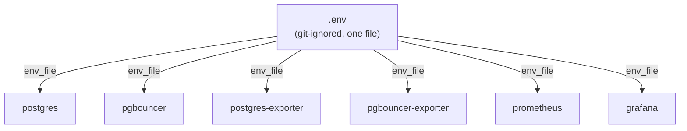

# Environment Variables

## Purpose

Every environment variable consumed by every service in this stack, in one place — what it does, what consumes it, and which defaults from `.env.example` are safe to keep and which must be changed before this environment is anything but a single developer's local machine.

## Architecture

Every one of the six services declares `env_file: [../../.env]` independently — there's one physical file, consumed six times, rather than one variable namespace shared implicitly. A variable unused by a given service is simply ignored by that service's container, not an error.

## Configuration

Full reference, grouped by component, from `.env.example`:

**Platform-wide**

| Variable | Default | Consumed by | Notes |
|---|---|---|---|
| `JOVAVIA_ENV` | `local` | Not yet read by any current compose file | Reserved for `local`/`dev`/`staging`/`prod` environment differentiation — see Future Improvements. |
| `JOVAVIA_REGION` | `ap-south-1` | Not yet read by any current compose file | Reserved for future Redis/Kafka/tracing region-based naming per the README's roadmap. |
| `JOVAVIA_PLATFORM` | `jovavia` | Not yet read by any current compose file | Reserved platform namespace. |

**PostgreSQL**

| Variable | Default | Consumed by |
|---|---|---|
| `POSTGRES_HOST` | `postgres` | pgbouncer, postgres-exporter |
| `POSTGRES_PORT` | `5432` | postgres, pgbouncer, postgres-exporter |
| `POSTGRES_USER` | `jovavia` | postgres, pgbouncer, postgres-exporter, pgbouncer-exporter |
| `POSTGRES_PASSWORD` | `change_me` | postgres, postgres-exporter, pgbouncer-exporter |

**PgBouncer**

| Variable | Default | Consumed by |
|---|---|---|
| `PGBOUNCER_PORT` | `6432` | pgbouncer, pgbouncer-exporter |
| `PGBOUNCER_POOL_MODE` | `transaction` | pgbouncer |
| `PGBOUNCER_MAX_CLIENT_CONN` | `5000` | pgbouncer |
| `PGBOUNCER_DEFAULT_POOL_SIZE` | `50` | pgbouncer |
| `PGBOUNCER_RESERVE_POOL_SIZE` | `20` | pgbouncer |
| `PGBOUNCER_RESERVE_POOL_TIMEOUT` | `5` | pgbouncer |
| `PGBOUNCER_QUERY_WAIT_TIMEOUT` | `120` | pgbouncer |
| `PGBOUNCER_SERVER_IDLE_TIMEOUT` | `300` | pgbouncer |
| `PGBOUNCER_SERVER_LIFETIME` | `3600` | pgbouncer |
| `PGBOUNCER_HOST` | `pgbouncer` | pgbouncer-exporter |

**Exporters & Observability**

| Variable | Default | Consumed by |
|---|---|---|
| `POSTGRES_EXPORTER_PORT` | `9187` | postgres-exporter |
| `PGBOUNCER_EXPORTER_PORT` | `9127` | pgbouncer-exporter |
| `PROMETHEUS_PORT` | `9090` | prometheus |
| `PROMETHEUS_RETENTION` | `15d` | prometheus |
| `GRAFANA_PORT` | `3000` | grafana |
| `GRAFANA_ADMIN_USER` | `admin` | grafana |
| `GRAFANA_ADMIN_PASSWORD` | `admin` | grafana |

## Operational Notes

`.env` is git-ignored (`.gitignore` explicitly excludes it) — `.env.example` is the committed template every developer copies from (`cp .env.example .env`, see [Local Development Setup](local-development.md)). This is the correct pattern for keeping real credentials out of version control; it relies entirely on every developer actually following it and never force-adding a real `.env`.

Variables not yet consumed anywhere (`JOVAVIA_ENV`, `JOVAVIA_REGION`, `JOVAVIA_PLATFORM`) are present in `.env.example` ahead of the components that will need them (Redis, Kafka, tracing — per the repository README's roadmap) — this is intentional forward-provisioning, not dead configuration, though it's worth knowing they currently do nothing.

**`POSTGRES_USER`/`POSTGRES_PASSWORD` also drive PgBouncer's client-facing credential, indirectly.** PgBouncer's `auth_file` isn't a file committed to git — `docker/pgbouncer/conf/userlist.template` holds only `"${POSTGRES_USER}" "${POSTGRES_PASSWORD}"`, and `start-pgbouncer.sh` resolves that template against the container's current environment into `/tmp/userlist.txt` on every startup, the same way it resolves `pgbouncer.ini.template`. There's no separate PgBouncer-specific password variable to manage — rotating `POSTGRES_PASSWORD` in `.env` and restarting the `pgbouncer` container is sufficient to rotate the credential PgBouncer authenticates clients with, too. Full mechanics in [PgBouncer Runbook](../runbooks/pgbouncer-runbook.md).

## Troubleshooting

**A service starts with unexpected/default behavior despite `.env` looking correct.** Confirm the variable name matches exactly — Compose does not warn on an unused or misspelled variable in `.env`; it simply isn't referenced, and the service falls back to whatever default is baked into its compose file's `${VAR:-default}` syntax (Postgres's own compose file has no such fallback for `POSTGRES_USER`/`PASSWORD`, so a missing value there fails outright, but PgBouncer's `PGBOUNCER_HOST` default in `.env.example` for the exporter has no compose-level fallback either — always verify against the actual `.env.example` value, not memory).

**Changed a variable but the running container doesn't reflect it.** `env_file` values are read at container **creation**, not continuously — `docker compose up -d` after an `.env` change only picks up the new value for containers that are recreated, not ones merely restarted in place. Use `docker compose up -d --force-recreate <service>` if a plain restart doesn't seem to apply a change.

**Credentials in `.env` don't match what a service was actually initialized with.** Common with `POSTGRES_PASSWORD` specifically — Postgres only applies it on first initialization of an empty data volume. See [Bootstrap Database](bootstrap-database.md) Troubleshooting and [PostgreSQL Runbook](../runbooks/postgres-runbook.md).

## Production Considerations

- **`POSTGRES_PASSWORD=change_me`, `GRAFANA_ADMIN_PASSWORD=admin` — both defaults are exactly what their names suggest: placeholders that must never reach a shared environment unchanged.** `.env.example`'s defaults are appropriate as *documentation of what's required*, not as values anyone copies forward past a developer's own laptop.
- **A flat `.env` file is not a secrets management solution.** It's the right choice for local development (simple, git-ignored, zero infrastructure dependency) and the wrong choice the moment more than one person needs access to real credentials, or credentials need rotation, audit history, or access control. See Future Improvements.
- **Every credential in this stack currently traces back to a single value, `POSTGRES_PASSWORD`** — PgBouncer's client-facing credential is templated from it at container startup rather than tracked separately (see [PgBouncer Runbook](../runbooks/pgbouncer-runbook.md)), which removes one class of drift but also means there's no credential isolation between the application layer and the observability layer; a leaked `.env` compromises everything at once.

## Future Improvements

- **Wire up `JOVAVIA_ENV`** to actually gate environment-specific behavior (e.g., stricter `pg_hba.conf` in non-local environments, different retention/logging verbosity) rather than sitting unused.
- **Replace `.env`-file secrets with a real secrets manager** (Vault, AWS/GCP/Azure Secrets Manager, or Kubernetes Secrets post-migration) for any environment beyond local development — this is the single highest-leverage security improvement available to this stack, touching Postgres, PgBouncer, and Grafana credentials simultaneously.
- Add `.env.example` validation to a setup script or CI check — flag any variable present in `docker-compose.yml`/component files but missing from `.env.example`, catching documentation drift automatically.
- Once `JOVAVIA_REGION` has a real consumer (Redis/Kafka per the roadmap), document the region-based naming convention here rather than leaving it implicit.
