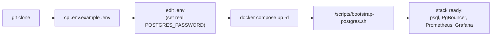

# Local Development Setup

## Purpose

The complete, exact sequence to bring up the full Jovavia infrastructure stack on a developer machine from a clean clone — every command is taken directly from what the repository's actual files require, not a generic Docker Compose tutorial.

## Architecture



Six services come up from one command; the five Jovavia databases require one additional script run afterward because they're created at the application layer, not baked into the Postgres image (see [Bootstrap Database](bootstrap-database.md) for why).

## Configuration

**Prerequisites:** Docker and Docker Compose (v2, for `include:` support — see [Docker Compose Architecture](../architecture/docker-compose-architecture.md)). No local PostgreSQL, Redis, or other tooling needed; everything runs in containers.

**Step by step:**

```bash
# 1. Clone and enter the repository
git clone https://github.com/jovavia/infra-deployment.git
cd infra-deployment

# 2. Create your local environment file
cp .env.example .env

# 3. Edit .env — at minimum, set real values for:
#    POSTGRES_PASSWORD, GRAFANA_ADMIN_PASSWORD
#    (see docs/setup/environment-variables.md for every variable)

# 4. Bring up the entire stack
docker compose up -d

# 5. Watch startup — Postgres must be healthy before others succeed
docker compose ps

# 6. Create the five Jovavia databases (idempotent, safe to re-run)
./scripts/bootstrap-postgres.sh
```

**Verify the stack is fully up:**

```bash
# PostgreSQL
docker compose exec postgres pg_isready -U jovavia

# PgBouncer
docker compose exec pgbouncer psql -h localhost -p 6432 -U jovavia pgbouncer -c "SHOW POOLS;"

# Prometheus targets (both should show UP)
curl -s http://localhost:9090/api/v1/targets | jq '.data.activeTargets[] | {job: .labels.job, health}'

# Grafana
curl -s http://localhost:3000/api/health
```

## Operational Notes

**Access points once running:**

| Service | URL |
|---|---|
| PostgreSQL (direct, admin use) | `localhost:5432` |
| PgBouncer (application use) | `localhost:6432` |
| Prometheus | `http://localhost:9090` |
| Grafana | `http://localhost:3000` (login: `GRAFANA_ADMIN_USER`/`GRAFANA_ADMIN_PASSWORD`) |

Application code and any manual `psql` sessions simulating application behavior should connect through PgBouncer (`:6432`), never directly to PostgreSQL (`:5432`) — see [ADR-0027: PgBouncer Connection Pooling Architecture](../adr/ADR-0027-pgbouncer-architecture.md) for why. Direct Postgres access is for administration, migrations, and the bootstrap script only.

**Stopping and restarting:**

```bash
docker compose stop        # stop containers, keep data
docker compose up -d       # resume
docker compose down        # stop and remove containers, keep named volumes (data survives)
docker compose down -v     # stop, remove containers AND named volumes (data is gone)
```

## Troubleshooting

**`docker compose up -d` fails immediately.** Confirm you're running Compose v2 with `include:` support (`docker compose version` — v2.20+ recommended); older Compose versions don't understand the `include:` directive the root `docker-compose.yml` relies on (see [Docker Compose Architecture](../architecture/docker-compose-architecture.md)).

**Some services show "unhealthy" or keep restarting right after startup.** Check `docker compose ps` for which one, then `docker compose logs <service>` — Postgres config errors, a missing `.env` variable, or (rarely) a port already in use on the host are the most common Sprint 0 causes. See the relevant component runbook ([PostgreSQL Runbook](../runbooks/postgres-runbook.md), [PgBouncer Runbook](../runbooks/pgbouncer-runbook.md), [Prometheus Runbook](../runbooks/prometheus-runbook.md), [Grafana Runbook](../runbooks/grafana-runbook.md)).

**`bootstrap-postgres.sh` fails with "unbound variable" or similar.** `.env` is missing a required value the script sources — the script does `set -a; source .env; set +a`, so any variable it references (`POSTGRES_USER`, `POSTGRES_PASSWORD`) must actually be set in your `.env`, not left as the placeholder from `.env.example`.

**Port already in use.** Another process on the host (possibly a previous, not-fully-torn-down stack, or an unrelated local Postgres) is bound to 5432, 6432, 9090, or 3000. `lsof -i :5432` (or the relevant port) to identify it, or change the corresponding `*_PORT` variable in `.env`.

## Production Considerations

- This document is explicitly for local development. Nothing here (default credentials, all ports published to host, no TLS) should be assumed safe to replicate verbatim in staging or production — see each component's runbook for the specific gaps and the fixes required first.
- There is currently no `Makefile` automation despite the file existing in the repo (`Makefile` is present but empty) — every step above is manual. See Future Improvements.

## Future Improvements

- **Populate the empty `Makefile`** with targets matching this document's steps exactly: `make up`, `make bootstrap`, `make down`, `make logs`, `make reset` (down -v + up + bootstrap in one command) — turning this document's manual sequence into single commands and reducing the chance of a skipped step.
- Add a `docker compose up -d --wait` pattern (Compose v2's built-in wait-for-healthy flag) to the setup sequence once all services have accurate healthchecks, removing the need to manually watch `docker compose ps`.
- Add a smoke-test script that runs the verification commands in this document automatically after startup and bootstrap, failing loudly if anything isn't actually ready.
- Consider a `docker-compose.override.yml` pattern for developer-specific local tweaks (different ports, resource limits) that shouldn't be committed to the main compose files.
